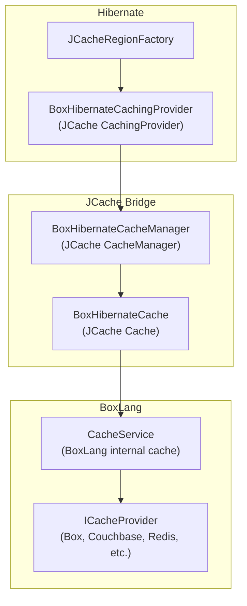

# BoxLang ORM — Cache Integration

## Overview

The ORM cache integration bridges Hibernate's second-level cache system with BoxLang's internal cache service. It provides a JSR-107 (JCache) `Cache` and `CacheManager` implementation backed by BoxLang's `CacheService`, enabling entity caching without external dependencies like Ehcache or Hazelcast (though those are also supported).

## Architecture



## Key Classes

| Class | Package | Implements | Responsibility |
|---|---|---|---|
| `BoxHibernateCachingProvider` | `ortus.boxlang.modules.orm.hibernate.cache` | `javax.cache.CachingProvider` | JCache provider entry point; creates `BoxHibernateCacheManager` |
| `BoxHibernateCacheManager` | same | `javax.cache.CacheManager` | Manages named caches; creates `BoxHibernateCache` instances |
| `BoxHibernateCache` | same | `javax.cache.Cache<K, V>` | Wraps BoxLang's `ICacheProvider` as a JSR-107 `Cache` |

## Configuration

### In `ORMConfig`

```java
// These properties control cache behavior
public String  cacheProvider   = "BoxCacheProvider";  // Default: use BoxLang's cache
public String  cacheConfigFile;                        // Path to jcache config
public IStruct cacheConfigProperties = CacheConfig.DEFAULTS;
```

### In `boxlang.json` or `Application.bx`

```js
this.ormSettings = {
    cacheProvider   : "BoxCacheProvider",
    cacheConfig     : {
        // Custom properties passed to ICacheProvider
    }
}
```

### Entity-Level Cache Configuration

BoxLang entities declare caching via CFML annotations:

```js
// Vehicle.bx
component
    persistent   = "true"
    table        = "vehicles"
    cacheuse     = "read-write"
    cachename    = "vehicleCache"
    cacheinclude = "all"  // or "non-lazy"
{
    property name="id" fieldtype="id" generator="increment";
    property name="make";
    property name="model";
}
```

These annotations flow through the `EntityRecord` → `IEntityMeta` → `HibernateXMLWriter` pipeline and produce the `<cache>` element in the HBM XML:

```xml
<class name="Vehicle" table="vehicles">
    <cache usage="read-write" region="vehicleCache" include="all"/>
    <!-- ... -->
</class>
```

## BoxHibernateCachingProvider

Entry point for JCache. Hibernate's `JCacheRegionFactory` calls this to obtain a `CacheManager`:

```java
public class BoxHibernateCachingProvider implements CachingProvider {

    @Override
    public CacheManager getCacheManager( URI uri, ClassLoader classLoader,
                                         Properties properties ) {
        return new BoxHibernateCacheManager( this, properties );
    }

    @Override
    public ClassLoader getDefaultClassLoader() {
        return getClass().getClassLoader();
    }

    @Override
    public URI getDefaultURI() {
        return URI.create( "boxlang://orm-cache" );
    }

    // ... other required methods
}
```

### Hibernate Wiring

```java
// In ORMConfig.toHibernateProperties()
props.setProperty(
    AvailableSettings.CACHE_REGION_FACTORY,
    "org.hibernate.cache.jcache.JCacheRegionFactory"
);
props.setProperty(
    "hibernate.javax.cache.provider",
    BoxHibernateCachingProvider.class.getName()
);
```

## BoxHibernateCacheManager

Manages named JCache regions, creating `BoxHibernateCache` instances on demand:

```java
public class BoxHibernateCacheManager implements CacheManager {
    private BoxRuntime           runtime;
    private CacheService         cacheService;
    private Map<String, Cache>   caches = new ConcurrentHashMap<>();

    @Override
    public <K, V> Cache<K, V> getCache( String cacheName ) {
        return caches.computeIfAbsent( cacheName, name ->
            new BoxHibernateCache<>( this, name )
        );
    }

    @Override
    public Iterable<String> getCacheNames() {
        return caches.keySet();
    }

    @Override
    public void close() {
        caches.values().forEach( Cache::close );
        caches.clear();
    }
}
```

## BoxHibernateCache

The core bridge — wraps a BoxLang `ICacheProvider` as a JSR-107 `Cache`:

```java
public class BoxHibernateCache<K, V> implements Cache<K, V> {
    private BoxRuntime          runtime;
    private CacheService        cacheService;
    private BoxHibernateCacheManager cacheManager;
    private String              cacheName;
    private boolean             closed = false;

    @Override
    public V get( K key ) {
        checkClosed();
        return (V) cacheService.get( cacheName, key );
    }

    @Override
    public void put( K key, V value ) {
        checkClosed();
        cacheService.set( cacheName, key.toString(), value );
    }

    @Override
    public boolean remove( K key ) {
        checkClosed();
        return cacheService.clear( cacheName, key.toString() );
    }

    @Override
    public void removeAll() {
        checkClosed();
        cacheService.clear( cacheName );
    }

    @Override
    public void clear() {
        checkClosed();
        cacheService.clear( cacheName );
    }

    @Override
    public boolean containsKey( K key ) {
        checkClosed();
        return cacheService.get( cacheName, key ) != null;
    }

    @Override
    public void close() {
        closed = true;
    }

    @Override
    public boolean isClosed() {
        return closed;
    }

    private void checkClosed() {
        if ( closed ) {
            throw new IllegalStateException( "Cache [" + cacheName + "] is closed" );
        }
    }

    // Entry processor, iterator, and configuration methods delegate to cacheService
    // ...
}
```

## Cache Strategies

Hibernate defines cache concurrency strategies. These are set per-entity via the `cacheuse` annotation:

| `cacheuse` value | Hibernate `CacheConcurrencyStrategy` | Use Case |
|---|---|---|
| `read-only` | `READ_ONLY` | Immutable reference data (countries, states) |
| `read-write` | `READ_WRITE` | General-purpose; soft-lock based isolation |
| `nonstrict-read-write` | `NONSTRICT_READ_WRITE` | Rarely-updated data; no locking |
| `transactional` | `TRANSACTIONAL` | JTA transaction-managed cache |

### Choosing a Strategy

```java
// Read-only: data never changes after insert
cacheuse = "read-only"

// Read-write: most common; handles concurrent reads and writes
cacheuse = "read-write"

// Nonstrict: infrequent updates, eventual consistency acceptable
cacheuse = "nonstrict-read-write"
```

## Cache Regions

Each entity type gets its own cache region (by default, the entity name). Custom regions are specified via `cachename`:

```js
// Group related entities in the same region
component cacheuse="read-write" cachename="vehicleData" {
    // Vehicles, Manufacturers, and Models share the "vehicleData" region
}
```

## Query Cache

HQL queries can also be cached via `ORMExecuteQuery` options:

```js
var results = ormExecuteQuery(
    "FROM Vehicle WHERE make = :make",
    { make : "Toyota" },
    false,  // not unique
    { cacheable : true, cachename : "vehicleQueries" }
)
```

## Cache Include Options

`cacheinclude` controls which data goes into the cache:

| Value | Behavior |
|---|---|
| `all` (default) | Cache both the entity and its lazy associations |
| `non-lazy` | Cache only the entity; exclude lazy-loaded associations |

## File Locations

```
src/main/java/ortus/boxlang/modules/orm/hibernate/cache/
├── BoxHibernateCache.java          # JSR-107 Cache implementation
├── BoxHibernateCacheManager.java   # JSR-107 CacheManager
└── BoxHibernateCachingProvider.java # JSR-107 CachingProvider
```

## Best Practices

1. **Prefer `BoxCacheProvider` for simplicity** — it uses BoxLang's built-in cache with zero external dependencies.
2. **Close caches properly** — call `close()` on `BoxHibernateCacheManager` during ORM shutdown (handled by `ORMApp.shutdown()`).
3. **`checkClosed()` guards all operations** — every `BoxHibernateCache` method checks `isClosed()` before delegating; new methods must do the same.
4. **Cache regions are isolated** — each named cache is a separate BoxLang cache region; don't mix entity types in the same region unless they share update patterns.
5. **Test with `read-write` strategy** — it's the most common and well-tested strategy; only use others if you have specific requirements.
6. **Key types are normalized to strings** — `cacheService.set( cacheName, key.toString(), value )` ensures consistent key handling regardless of the original key type.
