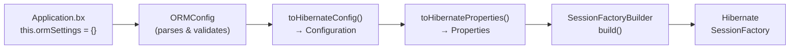

# BoxLang ORM — Configuration

## Overview

The configuration layer translates BoxLang ORM settings (defined in `Application.bx` or `boxlang.json`) into Hibernate's `Configuration` and property system. It provides a custom connection provider that bridges BoxLang datasources to Hibernate, configurable naming strategies, and comprehensive ORM settings management.

## Configuration Flow



## Key Classes

| Class | Package | Responsibility |
|---|---|---|
| `ORMConfig` | `ortus.boxlang.modules.orm.config` | Configuration manager, normalizer, validator; converts BoxLang settings to Hibernate props |
| `ORMConnectionProvider` | `ortus.boxlang.modules.orm.config` | Hibernate `ConnectionProvider` backed by BoxLang's `ConnectionManager` |
| `ORMKeys` | `ortus.boxlang.modules.orm.config` | Central constants: config keys, interception points, ORM metadata keys |
| `MacroCaseNamingStrategy` | `ortus.boxlang.modules.orm.config.naming` | `MACRO_CASE` physical naming strategy |
| `BoxLangClassNamingStrategy` | `ortus.boxlang.modules.orm.config.naming` | BoxLang naming conventions strategy |

## ORMConfig — Configuration Hub

### Property Categories

| Category | Properties | Default |
|---|---|---|
| **Mapping** | `generateMappings`, `autoGenMap` (deprecated) | `true` |
| **Session** | `autoManageSession` | `false` |
| **Cache** | `cacheProvider`, `cacheConfigFile`, `cacheConfigProperties` | `BoxCacheProvider` |
| **Schema** | `dialect`, `schema`, `catalog`, `ddl` (none/update/create/create-drop/validate) | auto-detect |
| **Naming** | `namingStrategy`, `tablePrefix` | `MacroCaseNamingStrategy` |
| **Paths** | `entityPaths`, `sqlScript` | `[ "/models" ]` |
| **Logging** | `logSQL`, `logSQLFormat`, `logSQLParameters`, `logLevel` | `false` |
| **Entity Defaults** | `useDBForMapping`, `eventHandler`, `datasource` | — |

### Configuration Parsing

```java
public class ORMConfig {
    // Core settings with defaults
    public boolean  generateMappings      = true;
    public boolean  autoManageSession     = false;
    public String   cacheProvider         = "BoxCacheProvider";
    public String   cacheConfigFile;
    public IStruct  cacheConfigProperties = CacheConfig.DEFAULTS;
    public String   dialect;
    public String   ddl                   = "none";
    public String   namingStrategy        = "MacroCaseNamingStrategy";
    public String   tablePrefix;
    public String   schema;
    public String   catalog;
    public boolean  logSQL                = false;
    public boolean  logSQLFormat          = false;
    public boolean  logSQLParameters      = false;
    public String   logLevel              = "WARN";
    public List<String> entityPaths       = List.of( "/models" );
    public String   eventHandler;
    public boolean  saveMapping           = true;
    // ... etc
}
```

### Converting to Hibernate Properties

```java
public Properties toHibernateProperties() {
    Properties props = new Properties();

    props.setProperty( AvailableSettings.DIALECT, resolveDialect() );
    props.setProperty( AvailableSettings.HBM2DDL_AUTO, ddl );
    props.setProperty( AvailableSettings.SHOW_SQL, String.valueOf( logSQL ) );
    props.setProperty( AvailableSettings.FORMAT_SQL, String.valueOf( logSQLFormat ) );
    props.setProperty( AvailableSettings.USE_SQL_COMMENTS, String.valueOf( logSQLParameters ) );
    props.setProperty( AvailableSettings.CURRENT_SESSION_CONTEXT_CLASS, "managed" );

    // Cache configuration
    if ( cacheProvider != null ) {
        props.setProperty( AvailableSettings.CACHE_REGION_FACTORY,
            "org.hibernate.cache.jcache.JCacheRegionFactory" );
        props.setProperty( "hibernate.javax.cache.provider",
            BoxHibernateCachingProvider.class.getName() );
    }

    // Default schema/catalog
    if ( schema != null ) props.setProperty( AvailableSettings.DEFAULT_SCHEMA, schema );
    if ( catalog != null ) props.setProperty( AvailableSettings.DEFAULT_CATALOG, catalog );

    return props;
}
```

### Naming Strategy Resolution

```java
public PhysicalNamingStrategy resolveNamingStrategy() {
    switch ( namingStrategy ) {
        case "MacroCaseNamingStrategy":
            return new MacroCaseNamingStrategy();
        case "BoxLangClassNamingStrategy":
            return new BoxLangClassNamingStrategy();
        default:
            // Try to load a custom class
            IClassRunnable strategyClass = CLASS_LOCATOR
                .loadClass( namingStrategy )
                .invokeConstructor()
                .getTarget();
            return new DynamicNamingStrategy( strategyClass );
    }
}
```

## ORMConnectionProvider — Datasource Bridge

Bridges BoxLang's `ConnectionManager` / `DataSource` system to Hibernate's `ConnectionProvider` interface:

```java
public class ORMConnectionProvider implements ConnectionProvider {
    private Key           datasourceName;
    private DataSource    dataSource;
    private BoxLangLogger logger;

    @Override
    public Connection getConnection() throws SQLException {
        // Get the current BoxLang context
        RequestBoxContext context = RequestBoxContext.getCurrent();
        // Obtain connection from BoxLang's ConnectionManager
        Connection conn = ConnectionManager
            .getConnection( context, datasourceName );
        return conn;
    }

    @Override
    public void closeConnection( Connection conn ) throws SQLException {
        // Return connection to BoxLang's connection pool
        ConnectionManager.releaseConnection( conn, datasourceName );
    }

    @Override
    public boolean supportsAggressiveRelease() {
        return false;  // BoxLang manages connection lifecycle
    }
}
```

**Important**: The `ORMConnectionProvider` is built once per datasource at ORM startup and registered with Hibernate via:

```java
configuration.setProperty(
    AvailableSettings.CONNECTION_PROVIDER,
    ORMConnectionProvider.class.getName()
);
```

## Naming Strategies

### MacroCaseNamingStrategy

Converts camelCase to MACRO_CASE:

| Input | Output |
|---|---|
| `authors` | `AUTHORS` |
| `bookAuthors` | `BOOK_AUTHORS` |
| `authorContact` | `AUTHOR_CONTACT` |

```java
public class MacroCaseNamingStrategy implements PhysicalNamingStrategy {
    @Override
    public Identifier toPhysicalTableName( Identifier logicalName, JdbcEnvironment env ) {
        return toMacroCase( logicalName );
    }
    // Also applies to catalog, schema, sequence, and column names
}
```

### BoxLangClassNamingStrategy

Applies BoxLang naming conventions (plug-in point; currently delegates to `MacroCaseNamingStrategy` with additional BoxLang-specific transforms).

## ORMKeys — Central Constants

```java
public class ORMKeys {
    // Service & context keys
    public static final Key ORMService     = Key.of( "ORMService" );
    public static final Key ORMContext     = Key.of( "ORMContext" );

    // Entity metadata keys
    public static final Key entityName          = Key.of( "entityname" );
    public static final Key table               = Key.of( "table" );
    public static final Key schema              = Key.of( "schema" );
    public static final Key catalog             = Key.of( "catalog" );
    public static final Key readOnly            = Key.of( "readonly" );
    public static final Key batchsize           = Key.of( "batchsize" );
    public static final Key cacheUse            = Key.of( "cacheuse" );
    public static final Key cacheName           = Key.of( "cachename" );
    public static final Key discriminatorColumn = Key.of( "discriminatorColumn" );
    public static final Key discriminatorValue  = Key.of( "discriminatorValue" );
    public static final Key fieldType           = Key.of( "fieldtype" );
    public static final Key persistent          = Key.of( "persistent" );
    public static final Key datasource          = Key.of( "datasource" );

    // Interception points
    public static final Key preORMLoad   = Key.of( "preORMLoad" );
    public static final Key postORMLoad  = Key.of( "postORMLoad" );
    public static final Key preORMSave   = Key.of( "preORMSave" );
    public static final Key postORMSave  = Key.of( "postORMSave" );
    public static final Key preORMDelete = Key.of( "preORMDelete" );
    public static final Key postORMDelete = Key.of( "postORMDelete" );
    // ... and more
}
```

**Always use `ORMKeys` constants** rather than string literals when accessing ORM metadata, context attachments, or interception points.

## File Locations

```
src/main/java/ortus/boxlang/modules/orm/config/
├── ORMConfig.java                 # Configuration manager
├── ORMConnectionProvider.java     # Hibernate ConnectionProvider bridge
├── ORMKeys.java                   # Central constants
├── EventListener.java             # Hibernate Integrator (covered in event-system skill)
└── naming/
    ├── MacroCaseNamingStrategy.java
    └── BoxLangClassNamingStrategy.java
```

## Best Practices

1. **Use `ORMKeys` constants exclusively** — never use string literals for ORM metadata keys; it prevents typos and makes refactoring safe.
2. **`Dialect` auto-detection is preferred** — ORMConfig attempts to detect the Hibernate dialect from the JDBC driver; only set explicitly when auto-detection fails.
3. **`ddl` values mirror Hibernate's `hbm2ddl.auto`** — `none`, `update`, `create`, `create-drop`, `validate`. Use `update` in development and `validate` in production.
4. **Connection provider is singleton per datasource** — it's created once and reused for all sessions on that datasource; don't hold per-session state.
5. **`cacheProvider` defaults to `BoxCacheProvider`** — this uses BoxLang's internal cache service; custom providers must implement `ICacheProvider`.
6. **BootstrapServiceRegistry must be closed on failure** — but not on success; see Session Management skill for details.
