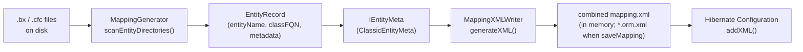

# BoxLang ORM — Entity Mapping

## Overview

Entity mapping is the **BoxLang → Hibernate** bridge entry point. The `MappingGenerator` walks the configured entity directories, discovers persistent BoxLang classes (`.bx` / `.cfc`), parses their metadata via inspectors, and produces Hibernate 7 `mapping.xml` documents that the `SessionFactoryBuilder` feeds into Hibernate's `Configuration`.

## Data Flow



## Key Classes

| Class | Package | Responsibility |
|---|---|---|
| `MappingGenerator` | `ortus.boxlang.modules.orm.mapping` | Walks directories, discovers entities, orchestrates XML generation |
| `EntityRecord` | `ortus.boxlang.modules.orm.mapping` | Value object holding entity name, FQN, class name, datasource, metadata, XML path |
| `IEntityMeta` | `ortus.boxlang.modules.orm.mapping.inspectors` | Interface for normalized entity metadata |
| `AbstractEntityMeta` | `ortus.boxlang.modules.orm.mapping.inspectors` | Shared base: property lists, discriminator, cache, batch size |
| `ClassicEntityMeta` | `ortus.boxlang.modules.orm.mapping.inspectors` | Translates CFML annotations (`persistent=true`, `fieldtype="id"`) into `IEntityMeta` |
| `IPropertyMeta` | `ortus.boxlang.modules.orm.mapping.inspectors` | Interface for normalized property metadata |
| `ClassicPropertyMeta` | `ortus.boxlang.modules.orm.mapping.inspectors` | Translates CFML property annotations into `IPropertyMeta` |
| `MappingXMLWriter` | `ortus.boxlang.modules.orm.mapping` | Builds a DOM `Document` from `IEntityMeta` in the Hibernate 7 `mapping.xml` format |

## Entity Discovery

### `MappingGenerator` Walk Algorithm

1. Reads `ormSettings.entityPaths` (array of directory paths) from `ORMConfig`.
2. For each path, recursively finds files ending in `.bx` or `.cfc`.
3. **Small directories** (&le; 20 entities): processed synchronously.
4. **Large directories** (&gt; 20 entities): processed asynchronously via virtual threads.
5. Each file is compiled to an `IClassRunnable` via `ClassLocator`.
6. Metadata is extracted from the compiled class and wrapped in an `EntityRecord`.

```java
// MappingGenerator constants
private static final String[] ENTITY_EXTENSIONS = { ".bx", ".cfc" };
private static final int    MAX_SYNCHRONOUS_ENTITIES = 20;
private static final String ENTITY_TEMP_FOLDER = "orm_mappings";
```

### Save-Mapping Behavior

| `saveMapping` | `saveAlongsideEntity` | Result |
|---|---|---|
| `true` (default) | `false` | XML files saved to temp directory (`orm_mappings/`) |
| `true` | `true` | XML files saved alongside each `.bx`/`.cfc` file |

```java
if ( saveAlongsideEntity ) {
    xmlFile = entityPath.resolveSibling( entityRecord.getClassName() + HBM_XML_EXT );
} else {
    xmlFile = tempDir.resolve( entityRecord.getClassName() + HBM_XML_EXT );
}
```

## EntityRecord Structure

```java
public class EntityRecord {
    String      entityName;     // e.g. "Vehicle" (from @Entity annotation or entityname)
    String      classFQN;       // e.g. "models.Vehicle"
    String      className;      // e.g. "Vehicle"
    Key         datasource;     // Datasource name this entity uses
    IStruct     metadata;       // Raw BoxLang class metadata struct
    Path        xmlFilePath;    // Path to generated .orm.xml
    IEntityMeta entityMeta;     // Parsed normalized metadata
    String      resolverPrefix; // "bx" or "cfc" — used when instantiating
}
```

The `resolverPrefix` is parsed from the class path:
```java
this.resolverPrefix = parseResolverPrefix(
    (String) this.metadata.getOrDefault(Key.path, ClassLocator.BX_PREFIX)
);
```

## Entity Metadata Inspectors

### `IEntityMeta` — The Normalized Contract

All entity metadata flows through this interface so the `MappingXMLWriter` works regardless of whether the entity uses CFML annotations or modern JPA-style annotations.

```java
public interface IEntityMeta {
    String      getEntityName();
    IStruct     getMeta();
    boolean     isSimpleEntity();    // Not derived from parent/discriminator
    boolean     isExtended();        // Has extends="ParentClass"
    String      getParentEntityName();
    String      getTableName();
    String      getCatalogName();
    String      getSchemaName();
    boolean     isImmutable();       // readOnly=true
    int         getBatchSize();
    IStruct     getCacheConfig();    // cacheUse, cacheName, cacheInclude
    IStruct     getDiscriminator();  // discriminatorColumn, discriminatorValue
    List<IPropertyMeta> getIdentifierProperties();
    List<IPropertyMeta> getPersistentProperties();
    List<IPropertyMeta> getAllProperties();
}
```

### `ClassicEntityMeta` — Annotation Translation

Translates traditional CFML annotations into the normalized interface:

| CFML Annotation | IEntityMeta Method |
|---|---|
| `entityname="Vehicle"` | `getEntityName()` |
| `table="vehicles"` | `getTableName()` |
| `schema="dbo"` | `getSchemaName()` |
| `catalog="mydb"` | `getCatalogName()` |
| `readOnly=true` | `isImmutable()` |
| `batchsize=25` | `getBatchSize()` |
| `cacheuse="read-write"`, `cachename="vehicles"` | `getCacheConfig()` |
| `discriminatorColumn="type"`, `discriminatorValue="car"` | `getDiscriminator()` |
| `extends="BaseEntity"` | `isExtended()`, `getParentEntityName()` |

### `IPropertyMeta` — Property Normalization

```java
public interface IPropertyMeta {
    String  getName();
    String  getType();           // "string", "numeric", "date", "boolean", "binary", "struct"
    String  getColumn();         // DB column name
    String  getFieldType();      // "id", "column", "one-to-many", "many-to-one", etc.
    String  getFormula();
    int     getLength();
    int     getScale();
    boolean isGenerated();       // generator="increment" or similar
    String  getGenerator();      // "increment", "identity", "uuid", etc.
    boolean isNotNull();
    IStruct getMeta();           // Raw property metadata
}
```

## Mapping XML Generation (`mapping.xml`)

### `MappingXMLWriter`

The only mapping writer (the legacy `HibernateXMLWriter`/`hbm.xml` path was removed). It builds a DOM
`Document` in the Hibernate 7 `mapping.xml` format: root `<entity-mappings>` in namespace
`http://www.hibernate.org/xsd/orm/mapping`, version `7.0`, one `<entity name="User" class="...UserFacade">`
per entity.

- `new MappingXMLWriter( entityMeta, entityLookup, ormConfig )` then `generateXML()` / `generateEntityElement()`.
- Per-element builders: `generateIdElement`, `generateVersionElement`, `generateBasicElement`,
  `generateToOneAssociation`, `generateToManyAssociation`, `generateCachingElement`, `addDiscriminatorData`.
- Child elements must follow `mapping-7.0.xsd` order. For a to-many: `order-by`, `map-key-class` +
  `map-key-column`/`map-key-formula`, `batch-size`, `sql-restriction`, `join-table`/`join-column`, `cascade`.

### Hibernate 5 parity defaults

JPA `mapping.xml` defaults differ from classic `hbm.xml`; the writer states these explicitly so existing
apps keep their behavior. Keep them when changing the writer:

| BoxLang mapping | Written as | Why |
| --- | --- | --- |
| `many-to-one` / `one-to-one` | explicit `fetch="LAZY"` unless `lazy="false"` or `fetch="join"` | JPA defaults to-one to EAGER |
| hierarchy root with `discriminatorValue` | `<discriminator-value>` on the root too | JPA defaults it to the entity name |
| `one-to-one` without `fkcolumn`/`mappedBy` | `<primary-key-join-column/>`; `constrained` side: `optional="false"` + FK; unconstrained side: `NO_CONSTRAINT`, or `mapped-by` when the target has a `constrained` one-to-one back | hbm shared the primary key, FK only on the constrained side |
| owning `one-to-many` without `fkcolumn` | `<join-column>` borrowed from the target's back-reference to-one (`resolveBackReferenceColumn`) | JPA would create a join table |
| collection `where` | `<sql-restriction>` (entity and element collections) | |
| `type="struct"` to-many | `map-key-class` + `map-key-column`/`map-key-formula` (`structKeyColumn`, `structKeyType`) | |
| `fieldtype="timestamp"` version | version typed `java.time.Instant` | |

### Entity Registration Pattern

`SessionFactoryBuilder` merges every entity's `<entity>` element into one combined `<entity-mappings>`
document (`buildCombinedMappingXml`) and hands it to Hibernate **in memory**:

```java
String combinedXml = buildCombinedMappingXml( ordered );
configuration.addInputStream( new ByteArrayInputStream( combinedXml.getBytes( StandardCharsets.UTF_8 ) ) );
```

With `saveMapping=true` each entity's XML is also written to a `*.orm.xml` file next to the entity.

## Custom Entity Metadata Inspector

To add a new annotation style (e.g., JPA `@Entity` / `@Id` annotations on BoxLang classes), implement `IEntityMeta`:

```java
public class ModernEntityMeta extends AbstractEntityMeta {

    public ModernEntityMeta( IStruct entityMeta ) {
        super( entityMeta );
        // Parse @Entity, @Table, @Id, @Column annotations
        IStruct annotations = entityMeta.getAsStruct( Key.annotations );
        this.entityName = annotations.getAsString( Key.entity )
            .orElse( meta.getAsString( Key.simpleName ) );
        // ... etc
    }
}
```

Then update `EntityRecord.setEntityMeta()` to detect the annotation style and instantiate the correct inspector.

## File Locations

```
src/main/java/ortus/boxlang/modules/orm/mapping/
├── MappingGenerator.java       # Entity discovery orchestrator
├── EntityRecord.java           # Entity value object
├── MappingXMLWriter.java       # DOM-based mapping.xml builder
└── inspectors/
    ├── IEntityMeta.java        # Normalized entity metadata interface
    ├── IPropertyMeta.java      # Normalized property metadata interface
    ├── AbstractEntityMeta.java # Shared entity metadata base
    ├── ClassicEntityMeta.java  # CFML annotation parser
    ├── AbstractPropertyMeta.java
    └── ClassicPropertyMeta.java # CFML property annotation parser
```

## Best Practices

1. **Always work through `IEntityMeta`** — never depend on `ClassicEntityMeta` directly in the writer. This enables future annotation styles.
2. **Respect `MAX_SYNCHRONOUS_ENTITIES`** — the 20-entity threshold exists because large synchronous processing blocks the BoxLang runtime.
3. **`entityName` is NOT `classFQN`** — the entity name comes from the `entityname` annotation or simple class name; the FQN is the dot-delimited path.
4. **Validate early** — catch invalid entity configurations before Hibernate gets them; throw `BoxRuntimeException` with descriptive messages.
5. **Temp file cleanup** — mapping files in `orm_mappings/` should be cleaned up on ORM shutdown when `saveAlongsideEntity` is `false`.
