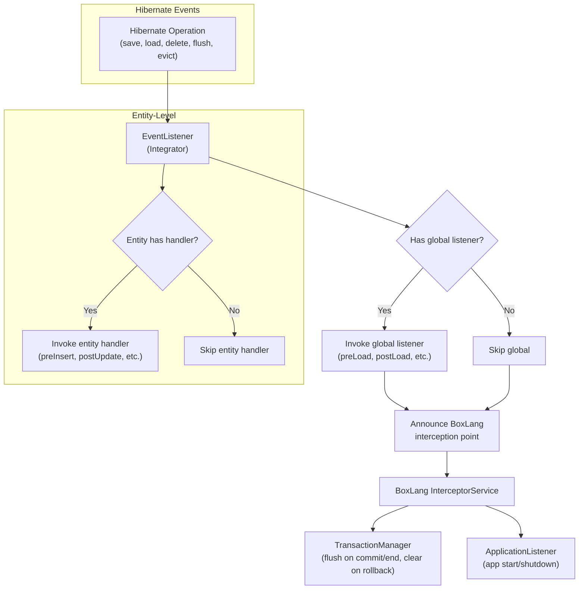

# BoxLang ORM — Event System

## Overview

The ORM event system bridges Hibernate's native event model with BoxLang's interception framework. It registers a Hibernate `Integrator` that hooks into every Hibernate lifecycle event (pre-insert, post-load, etc.) and translates those events into BoxLang interception announcements and entity-level event handler invocations.

## Architecture



## Key Classes

| Class | Package | Responsibility |
| --- | --- | --- |
| `EventListener` | `ortus.boxlang.modules.orm.config` | Hibernate `Integrator`; registers for all event types; dispatches to global & entity listeners |
| `TransactionManager` | `ortus.boxlang.modules.orm.interceptors` | BoxLang interceptor; syncs the session to BoxLang tx events (flush/clear). ORM rides the BoxLang tx connection — see `bx-orm-transactions`. |
| `ApplicationListener` | `ortus.boxlang.modules.orm.interceptors` | BoxLang interceptor; manages ORM app startup/shutdown |

## EventListener — Hibernate Integrator

> The integrator is registered only when `eventHandling=true` (`ORMConfig.toHibernateConfig()`), and
> `EntityNew.create()` fires `postNew` only then. With `eventHandling=false` (the default) no ORM event runs.

The `EventListener` implements `Integrator` and a dozen Hibernate event listener interfaces, giving it a hook into every phase of the entity lifecycle:

```java
public class EventListener
    implements Integrator,
               PreInsertEventListener, PostInsertEventListener,
               PreDeleteEventListener, PostDeleteEventListener, DeleteEventListener,
               PreUpdateEventListener, PostUpdateEventListener,
               PreLoadEventListener, PostLoadEventListener,
               FlushEventListener, AutoFlushEventListener,
               ClearEventListener, DirtyCheckEventListener, EvictEventListener {

    private DynamicObject globalListener;  // Optional global BoxLang listener
    private boolean       listenerReady;
}
```

### Event Registration (in `integrate()`)

```java
@Override
public void integrate( Metadata metadata, SessionFactoryImplementor sessionFactory,
                       SessionFactoryServiceRegistry serviceRegistry ) {
    EventListenerRegistry registry = serviceRegistry.getService( EventListenerRegistry.class );

    registry.prependListeners( EventType.PRE_INSERT, this );
    registry.prependListeners( EventType.POST_INSERT, this );
    registry.prependListeners( EventType.PRE_DELETE, this );
    registry.prependListeners( EventType.POST_DELETE, this );
    registry.prependListeners( EventType.DELETE, this );
    registry.prependListeners( EventType.PRE_UPDATE, this );
    registry.prependListeners( EventType.POST_UPDATE, this );
    registry.prependListeners( EventType.PRE_LOAD, this );
    registry.prependListeners( EventType.POST_LOAD, this );
    registry.prependListeners( EventType.AUTO_FLUSH, this );
    registry.prependListeners( EventType.FLUSH, this );
    registry.prependListeners( EventType.EVICT, this );
    registry.prependListeners( EventType.CLEAR, this );
    registry.prependListeners( EventType.DIRTY_CHECK, this );
}
```

### Event Dispatch Pattern

Each event handler follows the same pattern: build an args struct, invoke the global listener, then the entity-level handler, both through `ORMEventDispatcher`. The pre-operation events (`preInsert`, `preUpdate`, `preDelete`) are vetoable: `announceVetoable` calls both handlers and returns `true` to Hibernate when either returned `false`.

```java
@Override
public boolean onPreInsert( PreInsertEvent event ) {
    IClassRunnable entity = FacadeSupport.unwrap( event.getEntity() );
    IStruct args = Struct.of( ORMKeys.event, event, ORMKeys.entity, entity );

    // Global handler, then the entity's own method. Either returning false vetoes.
    if ( announceVetoable( ORMKeys.preInsert, event, entity, args ) ) {
        if ( event.getId() == null ) {
            // identity id: Hibernate cannot skip the INSERT, raise orm.event.veto instead
            throw new ORMException( ORMErrorType.EVENT_VETO, ... );
        }
        return true;  // true = veto
    }
    updateEntityEventState( ... );  // copy handler changes into Hibernate's state
    return false;
}
```

### Veto semantics

- Only an explicit `false` (or the strings `"false"` / `"no"`) vetoes (`ORMEventDispatcher.isVeto`). `void` handlers never veto.
- Both handlers always run, even when the first one vetoes.
- Vetoed insert: no row, but the entity stays in the session (evict it before changing it, or the next flush fails with `orm.stale`).
- Vetoed update: no SQL, the change stays, the entity stays dirty, and the update (and `preUpdate`) repeat on every flush. `entityReload()` discards it.
- Vetoed delete: the row stays; the entity leaves the session.
- Identity-id insert: cannot be vetoed; `orm.event.veto` error.
- Tests: `config/EventVetoTest`, fixtures `VetoThing.bx`, `VetoIdentityThing.bx`, global veto in `events/EventHandler.bx`.

### Entity Unwrapping

Always unwrap `BoxProxy` before dispatching events:

```java
private IClassRunnable unwrapEntity( Object entity ) {
    if ( entity instanceof BoxProxy proxy ) {
        return proxy.getRunnable();
    }
    if ( entity instanceof IClassRunnable runnable ) {
        return runnable;
    }
    return null;  // Shouldn't happen for BoxLang entities
}
```

### Global Listener Setup

The global listener is lazily instantiated from the `eventHandler` configuration:

```java
private void ensureListenerReady() {
    if ( listenerReady ) return;

    String eventHandlerClass = ormConfig.getEventHandler();
    if ( eventHandlerClass != null && !eventHandlerClass.isEmpty() ) {
        this.globalListener = CLASS_LOCATOR
            .loadClass( eventHandlerClass )
            .invokeConstructor()
            .getTarget();
    }
    this.listenerReady = true;
}
```

## TransactionManager — Transaction Lifecycle

> **The ORM does NOT run its own Hibernate transaction.** It **rides the BoxLang transaction's
> JDBC connection** (via `ORMConnectionProvider`), so BoxLang owns the real commit/rollback. The
> `TransactionManager` interceptor only synchronizes the Hibernate session with BoxLang's
> transaction events. **For the full design see the `bx-orm-transactions` skill.**

`TransactionManager` is a BoxLang interceptor that listens to BoxLang transaction events and
flushes/clears the Hibernate session accordingly — it does **not** call
`beginTransaction()`/`commit()`/`rollback()` on the Hibernate transaction:

```java
public class TransactionManager extends BaseInterceptor {

    @InterceptionPoint
    public void onTransactionCommit( IStruct args ) {
        // Flush pending SQL onto the shared transaction connection; BoxLang performs the JDBC commit.
        ormApp.getDatasources().forEach( datasource -> {
            Session session = ormContext.getSession( datasource );
            if ( session.isOpen() ) {
                session.flush();
            }
        } );
    }

    @InterceptionPoint
    public void onTransactionRollback( IStruct args ) {
        // Clear the session so it drops state BoxLang rolls back at the JDBC level (always, not gated on autoManageSession).
        ormApp.getDatasources().forEach( datasource -> {
            Session session = ormContext.getSession( datasource );
            if ( session.isOpen() ) {
                session.clear();
            }
        } );
    }
}
```

### Transaction Events

| Interception Point | ORM Action (BoxLang owns the real JDBC commit/rollback) |
| --- | --- |
| `onTransactionBegin` | Pre-flush pending work **only when** `autoManageSession=true` (Lucee compat). No Hibernate `beginTransaction()`. |
| `onTransactionCommit` | `session.flush()` — emit pending SQL on the shared connection; BoxLang commits it. |
| `onTransactionRollback` | `session.clear()` — discard pending/first-level cache; BoxLang rolls back the connection. Always runs (not gated on `autoManageSession`). |
| `onTransactionEnd` | `session.flush()` — final flush (no-op if already committed/cleared); BoxLang ends the unit. |
| `onTransactionSetSavepoint` | `session.flush()` on a `CHILD_*_END` savepoint (nested-unit boundary). |

### Read-your-writes inside a transaction

Because there is no Hibernate transaction, Hibernate suppresses auto-flush-before-query. The query
choke points (`ORMApp.loadEntitiesByFilter`, `HQLQuery.execute`) therefore call
`ORMContext.flushForQuery(session)`, which flushes when a BoxLang transaction is active so an
in-transaction ORM query observes its own pending writes.

### Nested transactions

Governed entirely by BoxLang. With the default `enableNestedTransactions=false` (experimental),
BoxLang **flattens** a nested `transaction{}`: a nested `transactionCommit()` performs a real JDBC
commit on the shared connection (commits the parent too). The interceptor treats every event
uniformly and lets BoxLang decide what commits.

Historical note: earlier the ORM ran its own Hibernate transaction (`beginTransaction()` /
`getTransaction().commit()` / `rollback()`) on a separate connection. That was replaced by the
connection-riding model so ORM writes and native `queryExecute` share one demarcation unit. The
`autoManageSession=true` pre-flush on begin retains [Lucee
compatibility](https://github.com/Ortus-Solutions/extension-hibernate/blob/857aef3/extension/src/main/java/ortus/extension/orm/HibernateORMTransaction.java#L48).

## ApplicationListener — Application Lifecycle

`ApplicationListener` is a BoxLang interceptor that orchestrates ORM application creation and shutdown:

```java
public class ApplicationListener extends BaseInterceptor {

    @InterceptionPoint
    public void onApplicationStart( IStruct args ) {
        IBoxContext context = args.getAs( IBoxContext.class, Key.context );
        ormService.startupORMApplication( context );
    }

    @InterceptionPoint
    public void onApplicationEnd( IStruct args ) {
        IBoxContext context = args.getAs( IBoxContext.class, Key.context );
        ormService.shutdownORMApplication( context );
    }

    @InterceptionPoint
    public void onSessionStart( IStruct args ) {
        // Initialize request-scoped ORM context
    }

    @InterceptionPoint
    public void onSessionEnd( IStruct args ) {
        // Tear down request-scoped ORM context
    }
}
```

## Adding a New Hibernate Event Type

To listen to a Hibernate event type not yet covered by `EventListener`:

1. Implement the corresponding Hibernate listener interface (e.g., `RefreshEventListener`).
2. Register it in the `integrate()` method:

   ```java
   registry.prependListeners( EventType.REFRESH, this );
   ```

3. Implement the callback method:

   ```java
   @Override
   public void onRefresh( RefreshEvent event ) throws HibernateException {
       IStruct args = Struct.of( "entity", unwrapEntity( event.getEntity() ) );
       invokeEntityEvent( args.getAs( IClassRunnable.class, "entity" ), "postRefresh", args );
   }
   ```

## Custom Entity Event Handler

BoxLang entity classes can receive ORM events by implementing handler methods:

```js
// models/Vehicle.bx
class {
    property name="id" fieldtype="id" generator="increment";
    property name="make";
    property name="model";

    function preInsert() {
        log.info( "About to insert Vehicle: #this.make# #this.model#" )
        // return false to veto the insert
    }

    function postLoad() {
        log.info( "Loaded Vehicle: #this.make# #this.model#" )
    }

    function preUpdate( struct oldData ) {
        log.info( "Updating Vehicle from #serializeJSON(oldData)#" )
    }
}
```

The `EventListener` automatically discovers and invokes these methods when the corresponding Hibernate event fires.

## File Locations

```
src/main/java/ortus/boxlang/modules/orm/
├── config/
│   └── EventListener.java           # Hibernate Integrator
└── interceptors/
    ├── TransactionManager.java      # BoxLang tx lifecycle interceptor
    └── ApplicationListener.java     # BoxLang app lifecycle interceptor
```

## Best Practices

1. **Always unwrap `BoxProxy` before event dispatch** — check `entity instanceof BoxProxy` and call `.getRunnable()` before passing to BoxLang handlers.
2. **Event handlers should not throw** — catch exceptions in event handlers to prevent Hibernate operations from failing due to listener errors.
3. **`requiresPostCommitHanding()` returns `false`** — BoxLang entities don't require post-commit handling; only override if your use case needs it.
4. **Use `prependListeners` not `appendListeners`** — prepending ensures the bx-orm listener runs before any other registered listeners.
5. **Global listeners are lazy** — the global `eventHandler` class is only instantiated on the first event, not at ORM startup.
6. **Transaction events fire per-datasource** — `TransactionManager` iterates all datasources in the ORM app; ensure all sessions participate.
