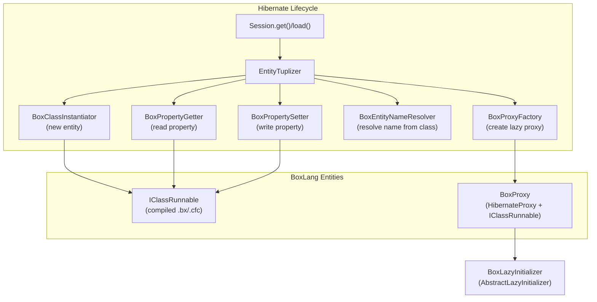

# BoxLang ORM — Hibernate Bridge (Tuplizer Architecture)

## Overview

The Hibernate bridge is the **heart** of bx-orm. It replaces every Java-reflection-based component in Hibernate's entity lifecycle with BoxLang-aware equivalents. Hibernate uses a *tuplizer* to perform all reflective operations on mapped entities. This module provides a complete custom tuplizer stack that works with `IClassRunnable` (BoxLang compiled classes) instead of Java POJOs.

## Architecture



## Key Classes

| Class | Extends/Implements | Responsibility |
|---|---|---|
| `EntityTuplizer` | `AbstractEntityTuplizer` | Entry point; wires all BoxLang-aware components into Hibernate |
| `BoxClassInstantiator` | `Instantiator` | Creates new `IClassRunnable` instances from entity metadata |
| `BoxProxy` | `IClassRunnable`, `HibernateProxy` | Lazy-loaded entity wrapper that delegates to real entity |
| `BoxProxyFactory` | `ProxyFactory` | Creates `BoxProxy` instances for lazy association loading |
| `BoxLazyInitializer` | `AbstractLazyInitializer` | Handles lazy state initialization and entity resolution |
| `BoxPropertyGetter` | `Getter` | Reads property values from `IClassRunnable` or loads by PK |
| `BoxPropertySetter` | `Setter` | Writes property values into `IClassRunnable` variables scope |
| `BoxEntityNameResolver` | `EntityNameResolver` | Resolves Hibernate entity name from an `IClassRunnable` instance |

## EntityTuplizer — The Core Bridge

```java
public class EntityTuplizer extends AbstractEntityTuplizer {

    public EntityTuplizer( EntityMetamodel entityMetamodel, PersistentClass mappingInfo ) {
        super( entityMetamodel, mappingInfo );
        // The super constructor calls our overridden buildInstantiator(),
        // buildPropertyGetter(), buildPropertySetter(), etc.
    }
}
```

### Overridden Methods

| Method | Returns | Purpose |
|---|---|---|
| `getEntityMode()` | `EntityMode.MAP` | Tells Hibernate to treat entities as dynamic-map objects |
| `buildInstantiator()` | `BoxClassInstantiator` | BoxLang-aware entity creation |
| `buildPropertyGetter()` | `BoxPropertyGetter` | BoxLang-aware property reads |
| `buildPropertySetter()` | `BoxPropertySetter` | BoxLang-aware property writes |
| `buildProxyFactory()` | `BoxProxyFactory` | Lazy proxy for BoxLang entities |
| `buildIdentifierGetter()` | `BoxPropertyGetter` | PK access via property getter |
| `buildIdentifierSetter()` | `BoxPropertySetter` | PK assignment via property setter |
| `getEntityNameResolvers()` | `BoxEntityNameResolver[]` | Entity name resolution from IClassRunnable |

### Identifier Handling

```java
@Override
public Serializable getIdentifier( Object entity ) {
    Object identifier = entity;
    if ( entity instanceof BoxProxy proxyEntity ) {
        identifier = ORMService.getEntityIdentifier( proxyEntity.getRunnable() );
    } else if ( entity instanceof IClassRunnable runnable ) {
        identifier = ORMService.getEntityIdentifier( runnable );
    }
    if ( identifier instanceof Serializable serializableId ) {
        return serializableId;
    }
    throw new IllegalArgumentException(
        "Entity identifier [" + StringCaster.cast( identifier ) + "] is not serializable."
    );
}
```

### Key Normalization

When Hibernate sets an identifier that is a BoxLang `Key` instance, the tuplizer unwraps it to a plain `String`:

```java
@Override
public void setIdentifier( Object entity, Serializable id, SharedSessionContractImplementor session ) {
    if ( id instanceof Key boxKey ) {
        id = boxKey.getName();  // Normalize Key → String
    }
    super.setIdentifier( entity, id, session );
}
```

## BoxClassInstantiator — Entity Creation

Creates BoxLang entity instances when Hibernate needs to materialize an entity (load, query result, etc.):

```java
public class BoxClassInstantiator implements Instantiator {
    private String entityName;       // Hibernate entity name
    private String resolverPrefix;   // "bx" or "cfc"
    private EntityMetamodel entityMetamodel;

    @Override
    public Object instantiate( Serializable id ) {
        // Resolve the BoxLang class via ClassLocator
        IClassRunnable entity = (IClassRunnable) classLocator
            .loadClass( resolverPrefix + ":" + entityName )
            .invokeConstructor( new Object[0] )
            .getTarget();

        // Set the ID if provided
        if ( id != null ) {
            ORMService.setEntityIdentifier( entity, id );
        }
        return entity;
    }

    @Override
    public boolean isInstance( Object object ) {
        return object instanceof IClassRunnable;
    }
}
```

Key behaviors:
- Uses `ClassLocator` with the resolver prefix (`bx` or `cfc`) to locate and instantiate the class
- Sets the entity identifier on the newly created instance
- Handles both BoxLang classes (`.bx`) and CFML components (`.cfc`)

## BoxProxy — Lazy Loading

`BoxProxy` implements **both** `IClassRunnable` (so it quacks like a BoxLang class) and `HibernateProxy` (so Hibernate recognizes it as a proxy):

```java
public class BoxProxy implements IClassRunnable, HibernateProxy {
    private BoxLazyInitializer lazyInitializer;
    private IClassRunnable     runnable;  // Cached after first access

    public BoxProxy( String entityName, Serializable id,
                     SharedSessionContractImplementor session,
                     PersistentClass mappingInfo ) {
        this.lazyInitializer = new BoxLazyInitializer( entityName, id, session );
    }

    public IClassRunnable getRunnable() {
        if ( runnable == null ) {
            runnable = lazyInitializer.getInstantiatedEntity();
        }
        return runnable;
    }
}
```

### Proxy Delegation Pattern

All `IClassRunnable` methods delegate to `getRunnable()`:
```java
@Override
public Object assign( IBoxContext context, Key key, Object value ) {
    return BoxClassSupport.assign( getRunnable(), context, key, value );
}

@Override
public Object dereference( IBoxContext context, Key key, Boolean safe ) {
    return BoxClassSupport.dereference( getRunnable(), context, key, safe );
}
```

### Serialization

```java
@Override
public Object writeReplace() {
    return this;  // Serialize self; Hibernate reconstitutes via BoxLazyInitializer
}
```

## BoxLazyInitializer

Extends Hibernate's `AbstractLazyInitializer` to handle BoxLang entity resolution:

```java
public class BoxLazyInitializer extends AbstractLazyInitializer implements Serializable {

    public BoxLazyInitializer( String entityName, Serializable id,
                               SharedSessionContractImplementor session ) {
        super( entityName, id, session );
    }

    @Override
    public Class getPersistentClass() {
        return BoxProxy.class;  // Hibernate knows what class the proxy wraps
    }

    public IClassRunnable getInstantiatedEntity() {
        if ( !isUninitialized() ) {
            initializeWithoutLoadIfPossible();
        }
        return (IClassRunnable) getImplementation();
    }
}
```

## BoxPropertyGetter

Handles two cases for reading entity properties:

1. **Direct access**: If the owner is an `IClassRunnable`, read directly from its variables scope.
2. **Primary-key lookup**: If the owner is a raw identifier (during association resolution), load the full entity by ID and read the property.

```java
public class BoxPropertyGetter implements Getter {
    private String propertyName;

    @Override
    public Object get( Object owner ) {
        if ( owner instanceof IClassRunnable entity ) {
            return entity.getVariablesScope().get( Key.of( propertyName ) );
        }
        // owner is a PK value — load the entity
        IClassRunnable entity = ORMService.loadEntityById( propertyName, owner );
        return entity.getVariablesScope().get( Key.of( propertyName ) );
    }
}
```

## BoxPropertySetter

Writes property values into the entity's variables scope:

```java
public class BoxPropertySetter implements Setter {
    private String propertyName;

    @Override
    public void set( Object target, Object value, SessionFactoryImplementor factory ) {
        if ( target instanceof IClassRunnable entity ) {
            entity.getVariablesScope().put( Key.of( propertyName ), value );
        }
    }
}
```

## BoxProxyFactory

Factory registered with Hibernate to create `BoxProxy` instances on demand:

```java
public class BoxProxyFactory implements ProxyFactory {
    private String          entityName;
    private PersistentClass mappingInfo;

    @Override
    public HibernateProxy getProxy( Serializable id,
                                    SharedSessionContractImplementor session ) {
        return new BoxProxy( entityName, id, session, mappingInfo );
    }
}
```

## BoxEntityNameResolver

Resolves the Hibernate entity name from a BoxLang class at runtime:

```java
public class BoxEntityNameResolver implements EntityNameResolver {

    @Override
    public String resolveEntityName( Object entity ) {
        if ( entity instanceof IClassRunnable runnable ) {
            return ORMService.getEntityName( runnable );
        }
        return null;
    }
}
```

## File Locations

```
src/main/java/ortus/boxlang/modules/orm/hibernate/
├── EntityTuplizer.java          # Core tuplizer (bridge entry point)
├── BoxClassInstantiator.java    # Entity instantiation
├── BoxProxy.java                # Lazy proxy (IClassRunnable + HibernateProxy)
├── BoxProxyFactory.java         # Proxy factory for Hibernate
├── BoxLazyInitializer.java      # Lazy initialization state
├── BoxPropertyGetter.java       # Property read access
├── BoxPropertySetter.java       # Property write access
└── BoxEntityNameResolver.java   # Entity name resolution
```

## Best Practices

1. **Always handle `BoxProxy` unwrapping** — check `instanceof BoxProxy` before `instanceof IClassRunnable` when both are possible; call `.getRunnable()` to get the real entity.
2. **Key normalization is mandatory** — BoxLang `Key` instances are not `Serializable` in the way Hibernate expects; normalize to `String` at bridge boundaries.
3. **`EntityMode.MAP` is critical** — this is what makes Hibernate treat entities as dynamic objects rather than POJOs; required for the entire bridge to function.
4. **Lazy proxy delegates everything** — every `IClassRunnable` method must delegate to `getRunnable()`; use `BoxClassSupport` static helpers for standard delegation.
5. **`writeReplace()` must return `this`** — the proxy serializes itself; Hibernate's deserialization reconstitutes via `BoxLazyInitializer`.
6. **The `IClassRunnable` in the proxy is cached** — after first access via `getRunnable()`, the resolved entity is cached in the `runnable` field; avoid re-resolving.
