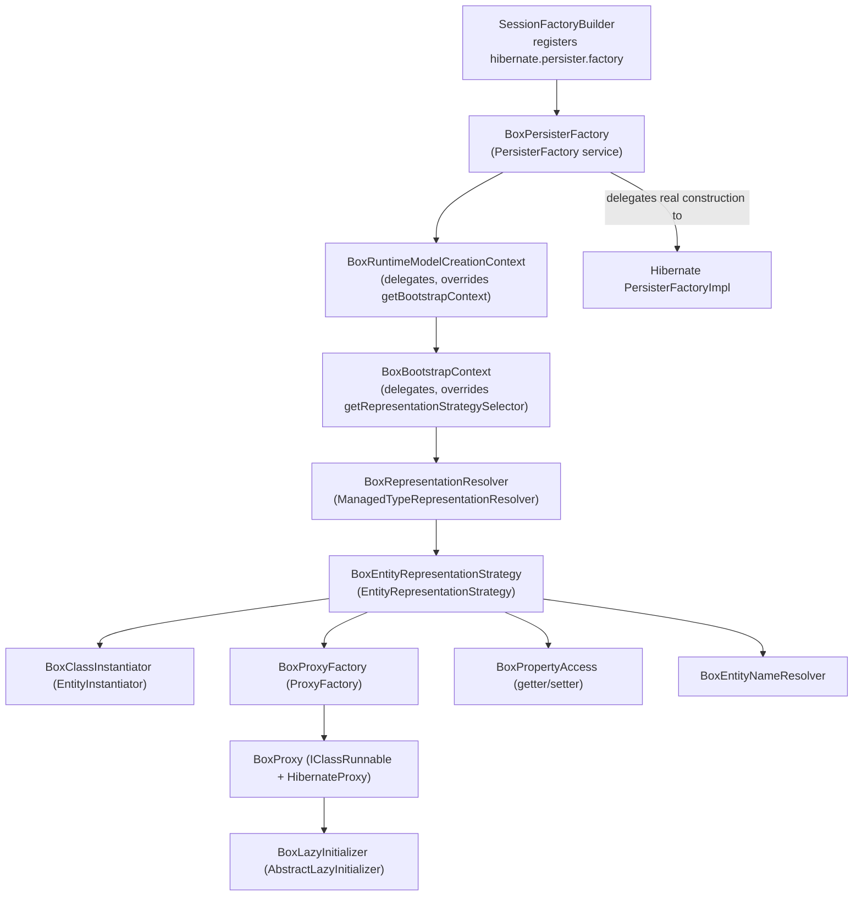

# BoxLang ORM — Hibernate Bridge (Representation-Strategy Architecture)

## Overview

The Hibernate bridge is the **heart** of bx-orm. It replaces every Java-reflection-based component in Hibernate's entity lifecycle with BoxLang-aware equivalents so that ORM entities written as `.bx`/`.cfc` classes (`IClassRunnable`, which implements `java.util.Map`) are handled as dynamic-map entities instead of Java POJOs.

Hibernate 5 exposed a *tuplizer* SPI (`EntityTuplizer`, `EntityMode.MAP`) for this. **Hibernate 6 removed the tuplizer** and replaced it with the `EntityRepresentationStrategy` SPI, chosen per entity by a `ManagedTypeRepresentationResolver`. Hibernate hard-codes that resolver in its bootstrap context with no setting to replace it, so bx-orm injects a BoxLang resolver through the one pluggable seam that hands the resolver to the entity persister: the `hibernate.persister.factory` service. No reflection or private API is used.

## Injection path



`BoxPersisterFactory` delegates the actual persister construction to Hibernate's own `PersisterFactoryImpl`; it only wraps the `RuntimeModelCreationContext` so the persister resolves its representation strategy through `BoxRepresentationResolver`. The two delegating context classes forward every method unchanged except the single override each needs.

## Key Classes

| Class | Implements / Extends | Responsibility |
|---|---|---|
| `BoxPersisterFactory` | `PersisterFactory`, `ServiceRegistryAwareService` | Registered as `hibernate.persister.factory`; wraps the creation context and delegates to `PersisterFactoryImpl` |
| `BoxRuntimeModelCreationContext` | `RuntimeModelCreationContext` | Delegating context; only override is `getBootstrapContext()` |
| `BoxBootstrapContext` | `BootstrapContext` | Delegating context; only override is `getRepresentationStrategySelector()` |
| `BoxRepresentationResolver` | `ManagedTypeRepresentationResolver` | Returns a `BoxEntityRepresentationStrategy` per entity; delegates embeddables to the standard resolver |
| `BoxEntityRepresentationStrategy` | `EntityRepresentationStrategy` | Wires the BoxLang-aware components into Hibernate; reports `RepresentationMode.MAP` |
| `BoxClassInstantiator` | `EntityInstantiator` | Creates new `IClassRunnable` instances from entity metadata |
| `BoxProxy` | `IClassRunnable`, `HibernateProxy` | Lazy-loaded entity wrapper that delegates to the real entity |
| `BoxProxyFactory` | `ProxyFactory` | Creates `BoxProxy` instances for lazy association loading |
| `BoxLazyInitializer` | `AbstractLazyInitializer` | Handles lazy state initialization and entity resolution |
| `BoxPropertyAccess` | `PropertyAccess` | Pairs the getter and setter for one mapped property |
| `BoxPropertyGetter` | `Getter` | Reads property values from `IClassRunnable`/id-map or loads by PK |
| `BoxPropertySetter` | `Setter` | Writes property values into the `IClassRunnable`/id-map |
| `BoxEntityNameResolver` | `EntityNameResolver` | Resolves the Hibernate entity name from an `IClassRunnable` instance |

> Removed at Hibernate 7: `EntityTuplizer` (extended `AbstractEntityTuplizer`) and `EntityMode`. Their role is now split across `BoxRepresentationResolver` + `BoxEntityRepresentationStrategy` (wiring) and the persister's `identifierMapping` (identifier get/set).

## Registration (SessionFactoryBuilder)

```java
// Route every entity persister through the BoxLang representation strategy.
properties.put( "hibernate.persister.factory", new BoxPersisterFactory( entityMap ) );
```

`entityMap` is the discovered entities keyed by lower-cased entity name, so the resolver can hand each `BoxEntityRepresentationStrategy` its `EntityRecord` without a runtime lookup (the persister is built at boot, before the ORM app is registered).

## BoxEntityRepresentationStrategy — the core bridge

```java
public class BoxEntityRepresentationStrategy implements EntityRepresentationStrategy {

    @Override public RepresentationMode getMode()            { return RepresentationMode.MAP; }
    @Override public EntityInstantiator getInstantiator()    { return instantiator; }        // BoxClassInstantiator
    @Override public ProxyFactory       getProxyFactory()    { return proxyFactory; }         // BoxProxyFactory or null
    @Override public JavaType<?>        getMappedJavaType()  { return mappedJavaType; }       // IClassRunnable
    @Override public JavaType<?>        getProxyJavaType()   { return proxyJavaType; }        // BoxProxy
    @Override public PropertyAccess resolvePropertyAccess( Property p ) { return new BoxPropertyAccess( p, bootDescriptor ); }
    @Override public void visitEntityNameResolvers( Consumer<EntityNameResolver> c ) { c.accept( new BoxEntityNameResolver() ); }
}
```

The mapped Java type is resolved as an entity type for `IClassRunnable` and the proxy type for `BoxProxy` via `creationContext.getTypeConfiguration().getJavaTypeRegistry()`.

## BoxClassInstantiator — entity creation

Implements `EntityInstantiator` (Hibernate 7), not the old `Instantiator`. `instantiate()` takes no id; the persister assigns the identifier afterwards through `identifierMapping`.

```java
public class BoxClassInstantiator implements EntityInstantiator {

    @Override
    public Object instantiate() {
        return instantiate( RequestBoxContext.getCurrent(), this.entityRecord, null );
    }

    @Override public boolean isInstance( Object object )  { /* IClassRunnable + entity-name match, incl. subclasses */ }
    @Override public boolean isSameClass( Object object ) { /* exact entity-name match, subclasses excluded */ }
}
```

`isSameClass` (strict, subclasses excluded) is what Hibernate uses to pick the concrete persister in an inheritance hierarchy; `isInstance` accepts subclasses.

## BoxProxy / BoxProxyFactory / BoxLazyInitializer — lazy loading

Identifiers are plain `Object` in Hibernate 7 (the `Serializable` requirement was dropped in 6.0).

```java
public class BoxProxyFactory implements ProxyFactory {
    @Override public void postInstantiate( String entityName, Class<?> persistentClass, Set<Class<?>> interfaces,
        Method getId, Method setId, CompositeType componentIdType ) { /* BoxLang has no id accessor methods; keep entityName */ }
    @Override public HibernateProxy getProxy( Object id, SharedSessionContractImplementor session ) {
        return new BoxProxy( entityName, id, session, mappingInfo );
    }
}

public class BoxLazyInitializer extends AbstractLazyInitializer {
    public BoxLazyInitializer( String entityName, Object id, SharedSessionContractImplementor session ) { super( entityName, id, session ); }
    @Override public Class<?> getPersistentClass()    { return BoxProxy.class; }
    @Override public Class<?> getImplementationClass(){ return isUninitialized() ? IClassRunnable.class : getImplementation().getClass(); }
}
```

`BoxProxy` implements both `IClassRunnable` (so it behaves like a BoxLang class) and `HibernateProxy`; every `IClassRunnable` method delegates to `getRunnable()`, which resolves and caches the real entity from the lazy initializer. `writeReplace()` returns `this`.

## BoxPropertyAccess / BoxPropertyGetter / BoxPropertySetter

Hibernate 7's property access is a `PropertyAccess` pairing a `Getter` and `Setter`. `BoxPropertyAccess` builds one per mapped property from the boot `Property`. These SPI interfaces are `@Deprecated(forRemoval)` for Hibernate 8, so expect another adjustment at that upgrade.

Getter and setter each handle two owners:

- an `IClassRunnable` — read/write the variables (and this) scope by `Key`;
- a `java.util.Map` — the value is a composite (embedded) identifier map that Hibernate populates and reads directly.

```java
// Getter (Hibernate 7 signatures)
@Override public Object get( Object owner ) { /* IClassRunnable scope, id-map, or PK-lookup load */ }
@Override public Object getForInsert( Object owner, Map<Object, Object> mergeMap, SharedSessionContractImplementor session ) { return get( owner ); }
@Override public Class<?> getReturnTypeClass() { return Object.class; }
@Override public Type getReturnType() { return Object.class; }
@Override public Member getMember() { return new MapMember( mappedProperty.getName(), mappedProperty.getType().getReturnedClass() ); }

// Setter (Hibernate 7 signature: no SessionFactory argument)
@Override public void set( Object target, Object value ) { /* IClassRunnable scope or id-map put */ }
```

`getMember()` must return Hibernate's synthetic `MapMember` (as dynamic-map entities do); returning `null` breaks the JPA metamodel builder for MAP entities.

## Identifiers and Key normalization

The old tuplizer's `getIdentifier`/`setIdentifier` and its `Key`→`String` normalization are gone. Identifier access now flows through the persister's `identifierMapping`, which uses `BoxPropertyAccess` like any other property. BoxLang scope keys are still `Key` instances, so the getter/setter convert names with `Key.of(...)` at the scope boundary. Composite identifiers arrive as a `java.util.Map` owner and are handled by the getter/setter's map branch.

## File Locations

```
src/main/java/ortus/boxlang/modules/orm/hibernate/
├── BoxRepresentationResolver.java        # ManagedTypeRepresentationResolver
├── BoxEntityRepresentationStrategy.java  # EntityRepresentationStrategy (bridge entry point)
├── BoxPersisterFactory.java              # hibernate.persister.factory service
├── BoxRuntimeModelCreationContext.java   # delegating creation context
├── BoxBootstrapContext.java              # delegating bootstrap context
├── BoxClassInstantiator.java             # entity instantiation (EntityInstantiator)
├── BoxProxy.java                         # lazy proxy (IClassRunnable + HibernateProxy)
├── BoxProxyFactory.java                  # proxy factory for Hibernate
├── BoxLazyInitializer.java               # lazy initialization state
├── BoxPropertyAccess.java                # PropertyAccess (getter + setter)
├── BoxPropertyGetter.java                # property read access
├── BoxPropertySetter.java                # property write access
└── BoxEntityNameResolver.java            # entity name resolution
```

## Best Practices

1. **Inject via the persister factory, never reflection.** The resolver is reached only through `BoxPersisterFactory` → delegating contexts. Keep those context wrappers pure delegators except for their single override.
2. **Always handle `BoxProxy` unwrapping** — check `instanceof BoxProxy` before `instanceof IClassRunnable` when both are possible, and call `.getRunnable()` to get the real entity.
3. **`RepresentationMode.MAP` is critical** — it is what makes Hibernate treat entities as dynamic objects rather than POJOs; the whole bridge depends on it.
4. **Getter must return a `MapMember`** — the JPA metamodel builder requires a `Member` for MAP entities; never return `null`.
5. **Identifiers are `Object`, not `Serializable`** — Hibernate 6 dropped the `Serializable` requirement; match the new signatures across proxy, initializer, and factory.
6. **Composite ids arrive as a `Map` owner** — the getter/setter map branch handles embedded identifiers; do not assume the owner is always an `IClassRunnable`.
7. **Getter/Setter SPI is deprecated for Hibernate 8** — `org.hibernate.property.access.spi.Getter`/`Setter` are marked for removal; revisit `BoxPropertyAccess` at that upgrade.
