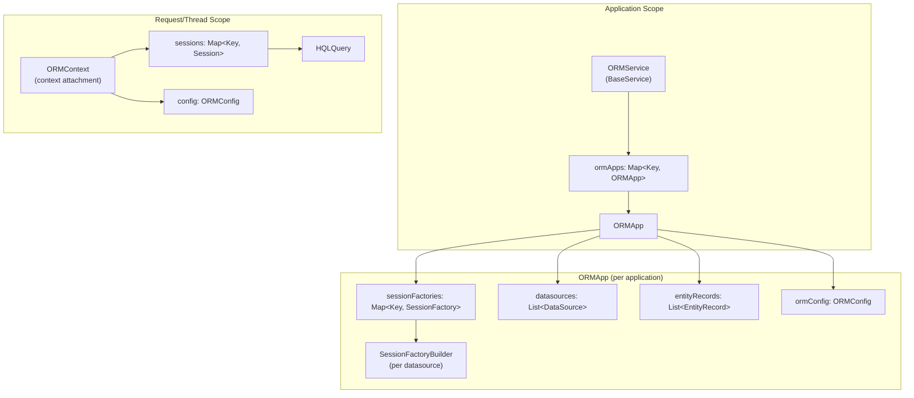

# BoxLang ORM — Session Management

## Overview

The session management layer controls the lifecycle of Hibernate `Session` and `SessionFactory` objects within the BoxLang runtime. It ensures correct session scoping (application, request, thread), proper shutdown, and datasource-aware session resolution.

## Architecture



## Key Classes

| Class | Scope | Responsibility |
|---|---|---|
| `ORMService` | Global (BoxRuntime service) | Entry point; manages `ORMApp` map; provides static helpers |
| `ORMApp` | Application | Holds session factories, datasources, config for one BoxLang app |
| `ORMContext` | Request / Thread | Manages Hibernate sessions for the lifetime of a context |
| `SessionFactoryBuilder` | Startup | Configures and builds a Hibernate `SessionFactory` per datasource |
| `HQLQuery` | Request | Wraps HQL query execution with parameter binding |

## ORMService — Global Service Layer

`ORMService` extends `BaseService` and is registered with the BoxLang runtime as a global service:

```java
public class ORMService extends BaseService {
    // The BoxLang runtime gets the ORM service via:
    // runtime.getGlobalService( ORMKeys.ORMService )

    private Map<Key, ORMApp> ormApps = new ConcurrentHashMap<>();

    // Interception points that the ORM service announces
    private static final Key[] ORM_INTERCEPTION_POINTS = List.of(
        ORMKeys.preORMLoad,
        ORMKeys.postORMLoad,
        ORMKeys.preORMSave,
        ORMKeys.postORMSave,
        // ... etc
    );
}
```

### Static Helper Methods

```java
// Get entity name from a compiled BoxLang class
public static String getEntityName( IClassRunnable entity ) {
    return entity.getMetaData()
        .getAsStruct( Key.annotations )
        .getAsString( ORMKeys.entityName );
}

// Get entity identifier from a BoxLang entity instance
public static Object getEntityIdentifier( IClassRunnable entity ) {
    return entity.getVariablesScope().get( ORMKeys.entityIdentifier );
}

// Set entity identifier on a BoxLang entity instance
public static void setEntityIdentifier( IClassRunnable entity, Object id ) {
    entity.getVariablesScope().put( ORMKeys.entityIdentifier, id );
}

// Get simple class name from FQN
public static String getClassNameFromFQN( String fqn ) {
    String[] parts = fqn.split( "\\." );
    return parts[ parts.length - 1 ];
}
```

### ORM Application Names

Each BoxLang application gets a unique ORM app name. This name is an MD5 hash of the application name and datasource configuration, ensuring unique session factory names across applications:

```java
public static Key getORMAppName( IBoxContext context ) {
    String appName = context.getApplicationName();
    String hash = EncryptionUtil.hash( appName + datasourceConfig );
    return Key.of( hash );
}
```

## ORMApp — Application-Scoped State

`ORMApp` persists for the lifetime of a BoxLang application and manages:

```java
public class ORMApp {
    private BoxLangLogger              logger;
    private Map<Key, SessionFactory>   sessionFactories;  // Keyed by datasource name
    private List<DataSource>           datasources;
    private List<EntityRecord>         entityRecords;
    private ORMConfig                  ormConfig;
    private Key                        appName;
}
```

### Startup Sequence

1. `ORMService.startupORMApplication( context )` is called on application start.
2. An `ORMApp` is created (or retrieved if already exists).
3. `MappingGenerator` discovers entities.
4. For each datasource, a `SessionFactoryBuilder` builds a Hibernate `SessionFactory`.
5. Session factories are stored in `sessionFactories` map, keyed by datasource name.

### Session Factory Retrieval

```java
public SessionFactory getSessionFactory( Key datasource ) {
    return sessionFactories.get( datasource );
}

// Convenience: get session factory for default datasource
public SessionFactory getDefaultSessionFactory() {
    return sessionFactories.get( datasources.get( 0 ).getName() );
}
```

### Shutdown

```java
public void shutdown() {
    // Close all session factories
    sessionFactories.values().forEach( SessionFactory::close );
    sessionFactories.clear();
    entityRecords.clear();
}
```

## ORMContext — Request/Thread-Scoped State

`ORMContext` is transient — it exists for the lifetime of a BoxLang request or thread. It's stored as a **context attachment** on `IBoxContext`:

```java
public class ORMContext {
    // Sessions opened during this context, keyed by datasource
    private Map<Key, Session> sessions = new ConcurrentHashMap<>();
    private ORMConfig         config;
}
```

### Context Attachment

```java
// Get (or create) the ORM context for the current request/thread
public static ORMContext getForContext( IJDBCCapableContext context ) {
    if ( !context.hasAttachment( ORMKeys.ORMContext ) ) {
        ORMContext ormContext = new ORMContext( config );
        context.setAttachment( ORMKeys.ORMContext, ormContext );
    }
    return context.getAttachment( ORMKeys.ORMContext );
}
```

### Session Retrieval

```java
public Session getSession( Key datasource ) {
    return sessions.computeIfAbsent( datasource, ds -> {
        SessionFactory factory = ormApp.getSessionFactory( ds );
        Session session = factory.openSession();
        // Apply flush mode, connection, etc.
        return session;
    } );
}
```

### Shutdown Listener

The ORM registers a shutdown listener that fires when a context is destroyed:

```java
private static Consumer<IBoxContext> shutdownListener = ctx -> {
    if ( !ctx.hasAttachment( ORMKeys.ORMContext ) ) return;

    ORMContext ormRequestContext = ctx.getAttachment( ORMKeys.ORMContext );
    // Close all sessions in this context
    ormRequestContext.getSessions().forEach( ( ds, session ) -> {
        if ( session.isOpen() ) {
            session.close();
        }
    } );
    ormRequestContext.getSessions().clear();
};
```

### Thread Safety Scenario

```java
// Example: parallel entity creation creates N+1 sessions
entityNew( "MyEntity" );  // Request context → 1 session

items.each( item -> {
    entityNew( "MyEntity" );  // Thread context → N sessions
}, true );  // parallel execution

// Each thread's ORMContext is auto-shutdown on thread completion.
// The request's ORMContext is shutdown at request end.
```

## SessionFactoryBuilder

Configures and builds a Hibernate `SessionFactory` for a single datasource:

```java
public class SessionFactoryBuilder {
    private Key                datasourceName;
    private ORMConfig          ormConfig;
    private List<EntityRecord> entities;
    private IJDBCCapableContext context;

    public SessionFactory build() {
        Configuration configuration = new Configuration();

        // 1. Set Hibernate properties from ORMConfig
        configuration.setProperties( ormConfig.toHibernateProperties() );

        // 2. Register custom components
        configuration.setEntityTuplizerFactory( EntityTuplizer::new );
        configuration.setInterceptor( new ORMInterceptor() );

        // 3. Set connection provider (BoxLang datasource → JDBC)
        configuration.setProperty(
            AvailableSettings.CONNECTION_PROVIDER,
            ORMConnectionProvider.class.getName()
        );

        // 4. Generate and add entity mappings
        for ( EntityRecord entity : entities ) {
            String xml = generateMapping( entity );
            configuration.addXML( xml );
        }

        // 5. Build the session factory
        return configuration.buildSessionFactory();
    }
}
```

### BootstrapServiceRegistry Management

The `BootstrapServiceRegistry` must remain open on success but closed on failure:

```java
try {
    SessionFactory sf = configuration.buildSessionFactory();
    // SUCCESS: don't close bootstrapRegistry — it's closed transitively via sf.close()
    return sf;
} catch ( Exception e ) {
    // FAILURE: close the registry to avoid resource leaks
    if ( bootstrapRegistry != null ) {
        bootstrapRegistry.close();
    }
    throw e;
}
```

## HQLQuery — HQL Execution

Wraps HQL query execution against the ORM session:

```java
public class HQLQuery {
    private Key              datasource;
    private Session          session;
    private ORMApp           ormApp;
    private IBoxContext      context;
    private ORMContext       ormContext;
    private List<QueryParameter> parameters;

    public HQLQuery( String hql, IBoxContext context, Key datasource ) {
        this.context = context;
        this.datasource = datasource;
        this.ormApp = ormService.getORMAppByContext( context );
        this.ormContext = ORMContext.getForContext( context );
        this.session = ormContext.getSession( datasource );
    }

    public Object execute() {
        org.hibernate.Query query = session.createQuery( hql );
        bindParameters( query );
        return query.list();
    }
}
```

## File Locations

```
src/main/java/ortus/boxlang/modules/orm/
├── ORMService.java             # Global service; ORMApp map; static helpers
├── ORMApp.java                 # Application-scoped state
├── ORMContext.java             # Request/thread-scoped session tracker
├── SessionFactoryBuilder.java  # Hibernate SessionFactory construction
└── HQLQuery.java               # HQL query wrapper
```

## Best Practices

1. **`ORMContext` is always attached to a context** — never hold a reference to `ORMContext` beyond the lifetime of its owning `IBoxContext`.
2. **Sessions are lazily created** — `getSession(datasource)` creates on first access; don't eagerly open sessions.
3. **Close sessions in reverse order** — if manual close is needed, close most-recently-opened first.
4. **The shutdown listener is registered once** — via `BoxRuntime` context lifecycle hooks; don't re-register.
5. **`BootstrapServiceRegistry` lifecycle is subtle** — close only on the failure path; on success, it lives as long as the `SessionFactory`.
6. **HQLQuery always goes through ORMContext** — never bypass the context to get a session directly.
