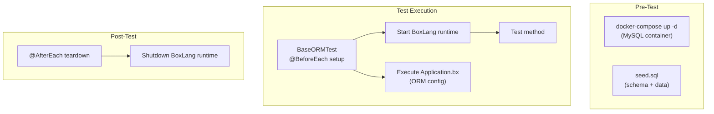

# BoxLang ORM — Testing

## Overview

ORM testing requires a running database, a configured BoxLang runtime with ORM enabled, and entity model fixtures. The test infrastructure uses Docker Compose for MySQL, JUnit 5 for test execution, and `BaseORMTest` as the shared test superclass.

## Test Infrastructure



## Key Files

| File | Location | Purpose |
|---|---|---|
| `BaseORMTest.java` | `src/test/java/tools/` | Shared test superclass; starts/stops BoxLang runtime |
| `JDBCTestUtils.java` | `src/test/java/tools/` | JDBC helper utilities for tests |
| `docker-compose.yml` | `/` (project root) | MySQL 8 container definition |
| `seed.sql` | `src/test/resources/` | Schema DDL + seed data |
| `Application.bx` | `src/test/resources/app/` | Test ORM configuration |

## BaseORMTest

The foundation for all ORM integration tests:

```java
package tools;

import ortus.boxlang.runtime.BoxRuntime;
import ortus.boxlang.runtime.context.IBoxContext;
import ortus.boxlang.runtime.context.RequestBoxContext;
import ortus.boxlang.runtime.scopes.VariablesScope;
import ortus.boxlang.runtime.types.IStruct;

public abstract class BaseORMTest {

    protected static BoxRuntime  instance;
    protected IBoxContext        context;
    protected VariablesScope     variables;

    @BeforeEach
    public void setUp() {
        // 1. Get (or start) the BoxLang runtime instance
        instance = BoxRuntime.getInstance();

        // 2. Create a request context
        context = new RequestBoxContext();

        // 3. Execute the test application config (Application.bx)
        instance.executeSource(
            Files.readString( Path.of( "src/test/resources/app/Application.bx" ) ),
            context
        );

        // 4. Get the variables scope for test assertions
        variables = context.getVariablesScope();
    }

    @AfterEach
    public void tearDown() {
        // Clean up the ORM session and shutdown the runtime
        if ( context != null ) {
            instance.executeSource( "ormCloseAllSessions()", context );
        }
    }
}
```

## Writing an ORM Test

### BIF Test Example

```java
package ortus.boxlang.modules.orm.bifs;

import static com.google.common.truth.Truth.assertThat;

import org.junit.jupiter.api.DisplayName;
import org.junit.jupiter.api.Test;

import ortus.boxlang.runtime.runnables.IClassRunnable;
import ortus.boxlang.runtime.types.Array;
import tools.BaseORMTest;

public class EntityLoadTest extends BaseORMTest {

    @DisplayName( "Can load all entities of a type" )
    @Test
    public void testLoadAll() {
        // @formatter:off
        Array results = (Array) instance.executeSource(
            """
            entityLoad( "Vehicle" )
            """,
            context
        );
        // @formatter:on
        assertThat( results.size() ).isGreaterThan( 0 );
    }

    @DisplayName( "Can load entity by primary key" )
    @Test
    public void testLoadByPK() {
        // @formatter:off
        IClassRunnable entity = (IClassRunnable) instance.executeSource(
            """
            entityLoadByPK( "Vehicle", 1 )
            """,
            context
        );
        // @formatter:on
        assertThat( entity ).isNotNull();
        assertThat( entity.getVariablesScope().get( "make" ) ).isNotNull();
    }

    @DisplayName( "Can load with filter criteria" )
    @Test
    public void testLoadWithFilter() {
        // @formatter:off
        Array results = (Array) instance.executeSource(
            """
            entityLoad( "Vehicle", { make : "Toyota" }, "model" )
            """,
            context
        );
        // @formatter:on
        assertThat( results.size() ).isGreaterThan( 0 );
    }
}
```

### Entity CRUD Test Example

```java
@DisplayName( "Can create, read, update, and delete an entity" )
@Test
public void testEntityCRUD() {
    // CREATE
    // @formatter:off
    instance.executeSource(
        """
        vehicle = entityNew( "Vehicle", {
            make  : "Honda",
            model : "Civic",
            year  : 2024
        } )
        entitySave( vehicle )
        ormFlush()
        """,
        context
    );
    // @formatter:on

    // READ
    IClassRunnable vehicle = (IClassRunnable) variables.get( "vehicle" );
    assertThat( vehicle.getVariablesScope().get( "make" ) ).isEqualTo( "Honda" );

    // UPDATE
    // @formatter:off
    instance.executeSource(
        """
        vehicle.model = "Accord"
        entitySave( vehicle )
        ormFlush()
        """,
        context
    );
    // @formatter:on
    assertThat( vehicle.getVariablesScope().get( "model" ) ).isEqualTo( "Accord" );

    // DELETE
    // @formatter:off
    instance.executeSource(
        """
        entityDelete( vehicle )
        ormFlush()
        """,
        context
    );
    // @formatter:on
}
```

### Transaction Test Example

```java
@DisplayName( "transaction block commits on success" )
@Test
public void testTransactionCommit() {
    // @formatter:off
    instance.executeSource(
        """
        transaction {
            entitySave( entityNew( "Manufacturer", {
                name    : "Tesla Inc",
                address : "1 Tesla Road"
            } ) )
        }
        result = entityLoad( "Manufacturer", { name : "Tesla Inc" }, true )
        """,
        context
    );
    // @formatter:on
    assertThat( variables.get( "result" ) ).isNotNull();
}
```

## Test Entity Models

Test entities are BoxLang persistent classes in `src/test/resources/app/models/`:

```
src/test/resources/app/models/
├── Vehicle.bx          # Main test entity (make, model, year)
├── Manufacturer.bx     # Related entity (name, address)
├── Feature.bx          # Feature flags or options
├── AlternateDS.cfc     # Tests alternate datasource binding
├── EventHandler.bx     # Tests entity event handling
├── Unresolvable.bx     # Tests error handling
└── CustomNamingStrategy.bx
```

### Sample Test Entity

```js
// Vehicle.bx
component
    persistent = "true"
    table      = "vehicles"
    entityname = "Vehicle"
{
    property name="id"    fieldtype="id" generator="increment";
    property name="make"  type="string"  length="100";
    property name="model" type="string"  length="100";
    property name="year"  type="numeric";
}
```

## Database Setup

### docker-compose.yml

```yaml
version: '3.8'
services:
  mysql:
    image: mysql:8.0
    environment:
      MYSQL_ROOT_PASSWORD: rootpass
      MYSQL_DATABASE: bxorm_test
      MYSQL_USER: boxlang
      MYSQL_PASSWORD: boxlang
    ports:
      - "3306:3306"
    volumes:
      - ./src/test/resources/seed.sql:/docker-entrypoint-initdb.d/seed.sql
```

### seed.sql

The seed file creates tables and optional test data:

```sql
CREATE TABLE IF NOT EXISTS vehicles (
    id    INT AUTO_INCREMENT PRIMARY KEY,
    make  VARCHAR(100) NOT NULL,
    model VARCHAR(100) NOT NULL,
    year  INT
);

CREATE TABLE IF NOT EXISTS manufacturers (
    id      INT AUTO_INCREMENT PRIMARY KEY,
    name    VARCHAR(200) NOT NULL,
    address VARCHAR(500)
);

-- Optional seed data
INSERT INTO vehicles (make, model, year) VALUES
    ('Toyota', 'Camry', 2023),
    ('Honda', 'Civic', 2022),
    ('Ford', 'Mustang', 2024);
```

## Test Application Configuration

### Application.bx

```js
// src/test/resources/app/Application.bx
class {
    this.name = "ORMTestApp"

    this.datasources = {
        "bxorm_test" : {
            driver   : "mysql",
            host     : "localhost",
            port     : 3306,
            database : "bxorm_test",
            username : "boxlang",
            password : "boxlang"
        }
    }

    this.ormSettings = {
        datasource       : "bxorm_test",
        entityPaths      : [ "#this.mapping#/models" ],
        generateMappings : true,
        ddl              : "update",
        logSQL           : false,
        namingStrategy   : "MacroCaseNamingStrategy"
    }
}
```

## Test Organization

```
src/test/java/ortus/boxlang/modules/orm/
├── TransactionManagerTest.java    # Transaction lifecycle tests
├── bifs/                           # BIF-specific tests
├── config/                         # Configuration tests
└── mapping/                        # Entity mapping tests
```

## Best Practices

1. **Always extend `BaseORMTest`** — it handles BoxLang runtime startup/shutdown; never manage the runtime manually in tests.
2. **Use Google Truth for assertions** — the project uses `com.google.common.truth.Truth.assertThat()` for fluent assertions.
3. **Use `@DisplayName` annotations** — JUnit 5 display names make test reports readable.
4. **Clean up after each test** — `ormFlush()` or `ormClearSession()` between tests to prevent state leakage.
5. **Use `// @formatter:off` / `@formatter:on`** — these markers prevent Spotless/Eclipse formatter from mangling multi-line BoxLang source strings in Java.
6. **Test with realistic data** — seed meaningful data that exercises real-world entity relationships (Vehicles belong to Manufacturers, etc.).
7. **Parallel test execution is supported** — tests use separate contexts; ensure database isolation when running in parallel.
8. **Docker Compose must be running** — run `docker-compose up -d` before executing integration tests; the `seed.sql` auto-initializes the schema.
