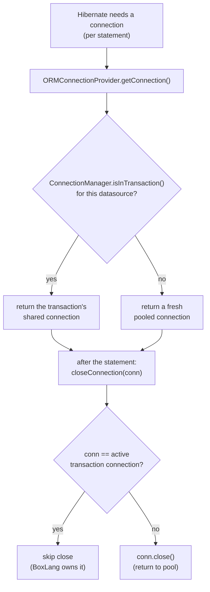
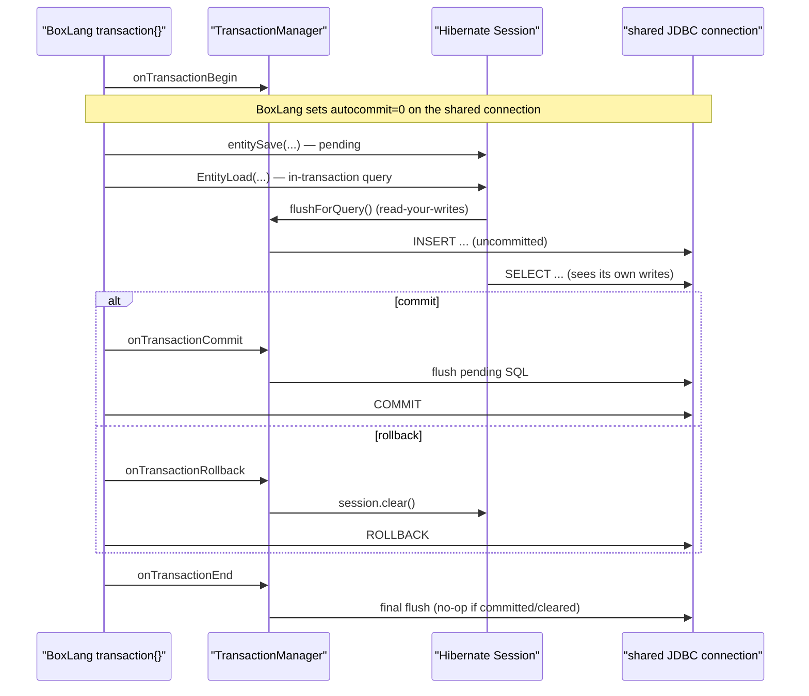

# BoxLang ORM — Transactions

## Overview

BoxLang owns database transactions through the `transaction{}` block. The ORM **does not run a
Hibernate transaction of its own**. Instead it **rides the BoxLang transaction's JDBC connection**
so that ORM writes (`entitySave`, flush, HQL DML) and native `queryExecute` calls land on the same
connection and are governed by one demarcation unit — committed together, rolled back together.
**BoxLang performs the real JDBC commit/rollback**; the ORM only keeps the Hibernate session in
step.

This replaced an earlier model where the ORM ran its own Hibernate transaction
(`session.beginTransaction()` / `getTransaction().commit()` / `rollback()`) on a **separate**
pooled connection. That model could not honor BoxLang's transaction semantics (an ORM write could
commit or roll back independently of the surrounding `transaction{}`).

## The four cooperating pieces

| Piece | File | Role |
|---|---|---|
| `ORMConnectionProvider` | `config/ORMConnectionProvider.java` | `getConnection()` returns the transaction's shared connection when in a `transaction{}`; `closeConnection()` skips closing it; `supportsAggressiveRelease()` returns `true`. |
| `SessionFactoryBuilder` | `SessionFactoryBuilder.java` | Sets `CONNECTION_HANDLING = DELAYED_ACQUISITION_AND_RELEASE_AFTER_STATEMENT` so the session acquires/releases per statement instead of holding one connection. |
| `TransactionManager` | `interceptors/TransactionManager.java` | Interceptor: flush on commit/end, clear on rollback. No Hibernate begin/commit/rollback. |
| `ORMContext.flushForQuery` | `ORMContext.java` | Flushes before an in-transaction ORM query so it sees its own pending writes (read-your-writes). |

## ORMConnectionProvider — riding the connection

```java
@Override
public Connection getConnection() throws SQLException {
    ConnectionManager cm = getConnectionManager();          // from RequestBoxContext → IJDBCCapableContext
    DataSource        ds = resolveDatasource( cm );
    // Transaction-aware: inside a transaction{} bound to this datasource, returns the transaction's
    // shared connection; otherwise a fresh pooled connection.
    return cm.getBoxConnection( ds );
}

@Override
public void closeConnection( Connection conn ) throws SQLException {
    // BoxLang owns the transaction connection's lifecycle (commit/rollback/close). Never close it here.
    if ( isActiveTransactionConnection( conn ) ) {
        return;
    }
    conn.close();
}
```

- `ConnectionManager.getBoxConnection(DataSource)` is the transaction-aware entry point: in a
  transaction for that datasource it returns `getTransaction().getBoxConnection()` (and sets the
  transaction's datasource if unset); otherwise a fresh pooled connection.
- `isActiveTransactionConnection(conn)` compares `conn` by identity against
  `connectionManager.getTransaction().getBoxConnection()`, but only once the transaction has bound
  a datasource (so we never force lazy creation of a transaction connection just to compare).
- `supportsAggressiveRelease()` **must** return `true` — see below.

## Why per-statement connection handling

`SessionFactoryBuilder.buildConfiguration()` sets:

```java
properties.put( AvailableSettings.CONNECTION_HANDLING,
    PhysicalConnectionHandlingMode.DELAYED_ACQUISITION_AND_RELEASE_AFTER_STATEMENT );
```

With the default handling mode Hibernate acquires **one** connection at first use and holds it for
the session's life. That breaks connection-riding two ways: (1) a session that first touches the DB
outside a transaction would keep a non-transactional connection for later in-transaction work; and
(2) after BoxLang closes the transaction connection at transaction end, the session would hold a
**stale, closed** connection ("Connection is closed" on the next query).

`RELEASE_AFTER_STATEMENT` makes the session acquire a connection **per statement** and release it
immediately — so each statement re-reads the *current* connection (transaction connection inside a
`transaction{}`, fresh pooled outside). Hibernate only honors this mode when the
`ConnectionProvider` reports `supportsAggressiveRelease() == true`; otherwise it silently falls back
to holding one connection. That is why `ORMConnectionProvider.supportsAggressiveRelease()` returns
`true`.

## Connection selection & release, per statement



## TransactionManager — session sync only

The interceptor listens to BoxLang transaction interception points and only flushes/clears the
Hibernate session. **It never calls `beginTransaction`/`commit`/`rollback` on Hibernate.**

| Interception point | Action |
|---|---|
| `onTransactionBegin` | Pre-flush pending work **only when** `autoManageSession=true` (Lucee compat). |
| `onTransactionCommit` | `session.flush()` — emit pending SQL on the shared connection; BoxLang commits it. |
| `onTransactionRollback` | `session.clear()` — discard pending writes + first-level cache; BoxLang rolls back the connection. **Always runs** (not gated on `autoManageSession`) — mandatory so pending work is never re-flushed at end. |
| `onTransactionEnd` | `session.flush()` — final flush (a `transaction{}` with no explicit commit); no-op if already committed/cleared. |
| `onTransactionSetSavepoint` | `session.flush()` on a `CHILD_*_END` savepoint (nested-unit boundary). |

Event ordering matters: BoxLang's `Transaction.commit()`/`rollback()` **announce the event first,
then perform the JDBC operation.** So flushing in `onTransactionCommit` puts SQL on the connection
*before* BoxLang commits; clearing in `onTransactionRollback` discards pending work *before* BoxLang
rolls back.



## Read-your-writes inside a transaction

Hibernate's `autoFlushIfRequired()` **returns early when no Hibernate transaction is in progress** —
so with `FlushMode.AUTO` (or `MANUAL`, which is what `autoManageSession=false` sessions use) an
in-transaction ORM query would run *before* its own pending inserts and miss them. Since the ORM
runs no Hibernate transaction, `FlushMode.ALWAYS` would not help either (same gate).

The fix is an explicit flush at the ORM query choke points:

```java
// ORMContext
public void flushForQuery( Session session ) {
    if ( session != null && session.isOpen() && getConnectionManager().isInTransaction() ) {
        session.flush();
    }
}
```

Called from `ORMApp.loadEntitiesByFilter` (EntityLoad by filter / list-all) and
`HQLQuery.execute()` (for read queries, i.e. not `UPDATE`/`DELETE` HQL). Outside a transaction it is
a no-op.

## Nested transactions (BoxLang-governed)

Nesting is decided entirely by BoxLang's runtime `enableNestedTransactions` setting (currently
**experimental, default `false`**):

- **`false` (default): nested `transaction{}` blocks are flattened** into the single outer
  demarcation unit. A nested `transactionCommit()` performs a **real JDBC commit** on the shared
  connection — it commits the parent too. A nested `transactionRollback()` rolls back the whole
  unit. No JDBC savepoints are created.
- **`true`: savepoint-based nesting** — a child begin/commit/end maps to `SAVEPOINT`s
  (`CHILD_<id>_BEGIN/_COMMIT/_END`), and a child rollback rolls back to its begin savepoint, so a
  child commit is scoped and does *not* commit the parent.

The `TransactionManager` does not try to reinterpret nesting — it handles every event uniformly and
lets BoxLang decide what actually commits. Tests that assert scoped-child semantics (e.g. "child
transaction cannot commit parent") require `enableNestedTransactions=true` and are `@Disabled` while
that flag is experimental.

## Gotchas

- **Do not** reintroduce `session.beginTransaction()` to "fix" autoflush — an active Hibernate
  transaction makes Hibernate hold the connection for the transaction duration, defeating
  `RELEASE_AFTER_STATEMENT` and reintroducing the stale-closed-connection bug. Use
  `flushForQuery` instead.
- `closeConnection` must compare by **identity** and must not force creation of a transaction
  connection just to compare (guard on `transaction.getDataSource() != null`).
- Clearing on rollback is **unconditional** (not `autoManageSession`-gated) in the connection-riding
  model — otherwise pending writes survive to `onTransactionEnd` and get committed after BoxLang has
  already rolled back.
- `autoManageSession=false` sessions are opened with `FlushMode.MANUAL` (see
  `ORMContext.getSession`), so nothing flushes except explicit `flush()`/`flushForQuery` and the
  interceptor's flushes.

## Where the code lives

```
src/main/java/ortus/boxlang/modules/orm/
├── config/ORMConnectionProvider.java     # transaction-aware getConnection + skip-close + aggressive release
├── SessionFactoryBuilder.java            # CONNECTION_HANDLING = RELEASE_AFTER_STATEMENT
├── interceptors/TransactionManager.java  # flush on commit/end, clear on rollback
├── ORMContext.java                       # flushForQuery (read-your-writes)
├── ORMApp.java                           # loadEntitiesByFilter → flushForQuery
└── HQLQuery.java                         # execute() → flushForQuery for read queries
```

Tests: `src/test/java/ortus/boxlang/modules/orm/TransactionManagerTest.java`.
