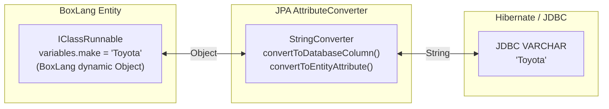

# BoxLang ORM — Type Conversion (Value Converters)

## Overview

BoxLang is a dynamically-typed language, while Hibernate/JDBC operates on statically-typed Java primitives and objects. The type conversion layer bridges this gap using JPA `AttributeConverter` implementations that translate between BoxLang's dynamic `Object` types and JDBC-compatible Java types.

## Conversion Flow



## Key Classes

| Converter | BoxLang Type | JDBC Type | Package |
|---|---|---|---|
| `StringConverter` | `String` / `Object` | `String` | `ortus.boxlang.modules.orm.hibernate.converters` |
| `BooleanConverter` | `Boolean` / `Object` | `Boolean` | same |
| `IntegerConverter` | `Integer` / `Object` | `Integer` | same |
| `LongConverter` | `Long` / `Object` | `Long` | same |
| `ShortConverter` | `Short` / `Object` | `Short` | same |
| `DoubleConverter` | `Double` / `Object` | `Double` | same |
| `BigDecimalConverter` | `BigDecimal` / `Object` | `BigDecimal` | same |
| `BigIntegerConverter` | `BigInteger` / `Object` | `BigInteger` | same |
| `DateTimeConverter` | `DateTime` / `Object` | `java.util.Date` | same |
| `TimeConverter` | `DateTime` / `Object` | `java.sql.Time` | same |

## Converter Pattern

Every converter implements the JPA `AttributeConverter<X, Y>` interface and is annotated with `@Converter( autoApply = true )`:

```java
@Converter( autoApply = true )
public class BooleanConverter implements AttributeConverter<Object, Boolean> {

    @Override
    public Boolean convertToDatabaseColumn( Object attribute ) {
        // BoxLang → JDBC
        return attribute != null ? BooleanCaster.cast( attribute ) : null;
    }

    @Override
    public Object convertToEntityAttribute( Boolean dbData ) {
        // JDBC → BoxLang
        return dbData;
    }
}
```

### Why `autoApply = true`?

The `autoApply` flag tells Hibernate to apply this converter to ALL entity attributes of the target JDBC type, without requiring explicit `@Convert` annotations on every property. This is essential because BoxLang entities don't use Java annotations.

## Converter Details

### StringConverter

```java
@Converter( autoApply = true )
public class StringConverter implements AttributeConverter<Object, String> {

    @Override
    public String convertToDatabaseColumn( Object attribute ) {
        return attribute != null ? StringCaster.cast( attribute ) : null;
    }

    @Override
    public Object convertToEntityAttribute( String dbData ) {
        return dbData;  // Return raw String; BoxLang handles it
    }
}
```

### DateTimeConverter

Uses BoxLang's `DateTimeCaster` for bidirectional conversion:

```java
@Converter( autoApply = true )
public class DateTimeConverter implements AttributeConverter<Object, Date> {

    @Override
    public Date convertToDatabaseColumn( Object attribute ) {
        return attribute != null
            ? DateTimeCaster.cast( attribute ).toDate()
            : null;
    }

    @Override
    public Object convertToEntityAttribute( Date dbData ) {
        return dbData != null
            ? DateTimeCaster.cast( dbData )
            : dbData;
    }
}
```

**Key insight**: `convertToEntityAttribute` returns `DateTimeCaster.cast(dbData)`, which produces a BoxLang-compatible DateTime object, NOT a raw `java.util.Date`.

### Numeric Converters

All numeric converters follow the same pattern — use BoxLang casters for the BoxLang → JDBC direction:

```java
@Converter( autoApply = true )
public class IntegerConverter implements AttributeConverter<Object, Integer> {

    @Override
    public Integer convertToDatabaseColumn( Object attribute ) {
        return attribute != null ? IntegerCaster.cast( attribute ) : null;
    }

    @Override
    public Object convertToEntityAttribute( Integer dbData ) {
        return dbData;
    }
}

@Converter( autoApply = true )
public class BigDecimalConverter implements AttributeConverter<Object, BigDecimal> {

    @Override
    public BigDecimal convertToDatabaseColumn( Object attribute ) {
        return attribute != null ? BigDecimalCaster.cast( attribute ) : null;
    }

    @Override
    public Object convertToEntityAttribute( BigDecimal dbData ) {
        return dbData;
    }
}

@Converter( autoApply = true )
public class BigIntegerConverter implements AttributeConverter<Object, BigInteger> {

    @Override
    public BigInteger convertToDatabaseColumn( Object attribute ) {
        return attribute != null ? BigIntegerCaster.cast( attribute ) : null;
    }

    @Override
    public Object convertToEntityAttribute( BigInteger dbData ) {
        return dbData;
    }
}
```

## Converter Registration

Converters are discovered by Hibernate via the `persistence.xml` or through the Hibernate `Configuration`. In bx-orm, they are registered programmatically in the `ORMConfig`:

```java
// In ORMConfig.toHibernateConfig()
configuration.addAttributeConverter( BooleanConverter.class );
configuration.addAttributeConverter( StringConverter.class );
configuration.addAttributeConverter( IntegerConverter.class );
configuration.addAttributeConverter( LongConverter.class );
configuration.addAttributeConverter( ShortConverter.class );
configuration.addAttributeConverter( DoubleConverter.class );
configuration.addAttributeConverter( BigDecimalConverter.class );
configuration.addAttributeConverter( BigIntegerConverter.class );
configuration.addAttributeConverter( DateTimeConverter.class );
configuration.addAttributeConverter( TimeConverter.class );
```

## Creating a Custom Converter

To add a converter for a type not already covered (e.g., JSON, UUID, Enum):

```java
package ortus.boxlang.modules.orm.hibernate.converters;

import javax.persistence.AttributeConverter;
import javax.persistence.Converter;

import ortus.boxlang.runtime.dynamic.casters.GenericCaster;
import ortus.boxlang.runtime.types.IStruct;
import ortus.boxlang.runtime.types.Struct;

@Converter( autoApply = true )
public class JsonConverter implements AttributeConverter<Object, String> {

    @Override
    public String convertToDatabaseColumn( Object attribute ) {
        if ( attribute == null ) return null;
        // Serialize BoxLang struct/array to JSON string
        return GenericCaster.castToJson( attribute );
    }

    @Override
    public Object convertToEntityAttribute( String dbData ) {
        if ( dbData == null ) return null;
        // Deserialize JSON string back to BoxLang struct/array
        return GenericCaster.castFromJson( dbData );
    }
}
```

Then register it in the configuration:
```java
configuration.addAttributeConverter( JsonConverter.class );
```

## Null Handling Convention

All converters follow the same null-handling convention:

```java
@Override
public JDBCType convertToDatabaseColumn( Object attribute ) {
    return attribute != null ? cast( attribute ) : null;
}

@Override
public Object convertToEntityAttribute( JDBCType dbData ) {
    return dbData != null ? wrapForBoxLang( dbData ) : dbData;
}
```

- **BoxLang → JDBC**: Null in, null out; non-null values are cast to the JDBC type.
- **JDBC → BoxLang**: Null in, null out; non-null values may be wrapped in BoxLang-compatible types (e.g., `DateTimeCaster.cast()` for dates).

## File Locations

```
src/main/java/ortus/boxlang/modules/orm/hibernate/converters/
├── BigDecimalConverter.java
├── BigIntegerConverter.java
├── BooleanConverter.java
├── DateTimeConverter.java
├── DoubleConverter.java
├── IntegerConverter.java
├── LongConverter.java
├── ShortConverter.java
├── StringConverter.java
└── TimeConverter.java
```

## Best Practices

1. **Always use `@Converter( autoApply = true )`** — BoxLang entities can't use `@Convert` annotations; auto-apply ensures every entity property gets the right converter.
2. **Use BoxLang casters in `convertToDatabaseColumn`** — `StringCaster.cast()`, `BooleanCaster.cast()`, `IntegerCaster.cast()`, `DateTimeCaster.cast()`, etc. These handle BoxLang's dynamic type coercion.
3. **Return BoxLang-compatible types from `convertToEntityAttribute`** — for dates, use `DateTimeCaster.cast()`; for strings, return the raw `String`; never return types that BoxLang can't dereference.
4. **Null handling must be symmetric** — both directions must return `null` for `null` input; never throw on null.
5. **Register converters in `ORMConfig`** — converters must be registered programmatically because bx-orm doesn't use `persistence.xml`.
6. **Watch for type priority conflicts** — if two converters target the same JDBC type, Hibernate may pick the wrong one. Keep `autoApply` converters mutually exclusive by JDBC target type.
