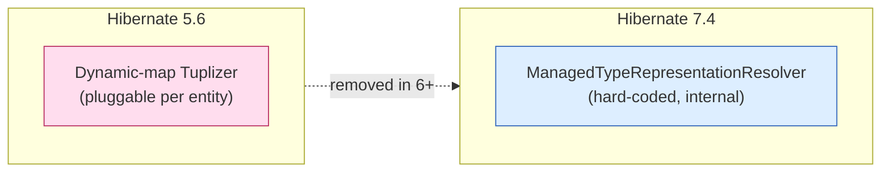
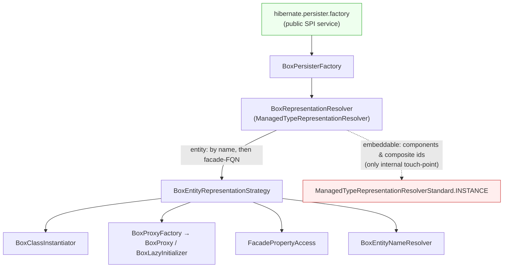
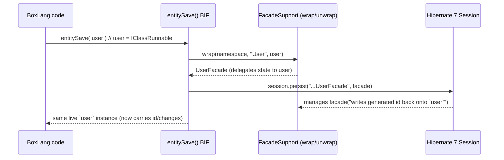
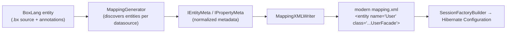
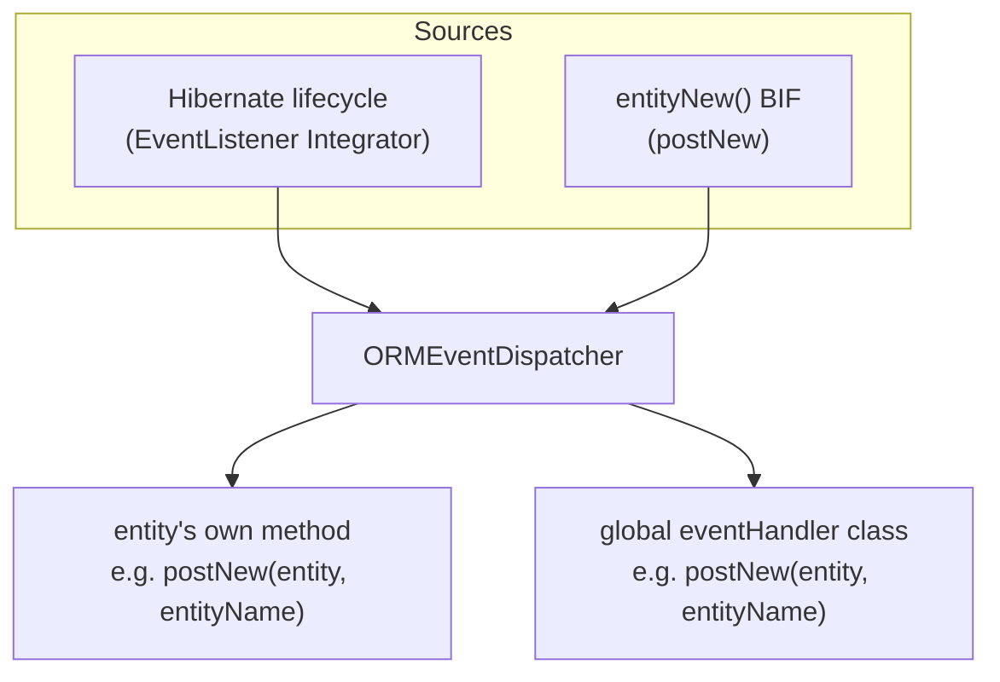

# bx-orm Developer Guide: The Hibernate 5 → 7 Migration

> Audience: contributors and reviewers of `bx-orm`. This document explains **why** the
> module is built the way it is, the design decisions behind the Hibernate 5.6 → 7.4
> migration, and where we intend to take it next. For day-to-day API usage see the end-user
> docs (`ortus-docs/bxorm`); for architecture deep-dives per subsystem see
> `.agents/skills-custom/`.

---

## 1. What bx-orm is

`bx-orm` is the middleware that lets the dynamic **BoxLang** JVM language use **Hibernate ORM**
as its persistence engine. It hides both raw database access and Hibernate's verbose
configuration behind BoxLang-native BIFs (`entityNew`, `entitySave`, `entityLoad`,
`ormExecuteQuery`, …) and `Application.bx` ORM settings.

```
BoxLang app  ──►  bx-orm (this module)  ──►  Hibernate ORM 7.4  ──►  JDBC / RDBMS
   BIFs &          representation bridge,        session factory,
 Application.bx    mapping generation,           dialects, caching
                   events, type conversion
```

The module runs on **Hibernate ORM 7.4.x** (upgraded from 5.6.15). All Hibernate
integration code targets Hibernate 7, not 5.

---

## 2. The core problem the migration had to solve

A BoxLang entity is **not a normal Java class**. It is an `IClassRunnable` — a dynamic object
that implements `java.util.Map`. Hibernate 5 supported non-POJO entities through **Tuplizers**
(`EntityTuplizer` / `Tuplizer`), which let us describe how to instantiate an entity, read a
property, and proxy it, for a "dynamic-map" representation.

**Hibernate 6+ removed Tuplizers.** Instead it resolves how a managed type is represented
through a single internal component, `ManagedTypeRepresentationResolver`, which Hibernate
**hard-codes** to its own standard implementation. There is no drop-in replacement for the old
dynamic-map tuplizer.

So the migration's central question was: *how do we make Hibernate 7 manage a BoxLang
`IClassRunnable` as an entity when Hibernate 7 only wants to manage real Java classes?*



---

## 3. Two representations we evaluated

| Option | What it is | Verdict |
| --- | --- | --- |
| **MAP (class-less)** | Keep entities as dynamic maps; describe them to Hibernate as class-less `<entity metadata-complete="true">` with no backing class. | Worked for basic CRUD, but Hibernate 7's JPA-centric machinery could not express several documented features against a class-less entity: `uuid`/most id generators, composite ids, `byte[]`/binary attributes, and full metamodel access. **Removed.** |
| **POJO facade** ✅ | Generate a **real Java class per entity** (a "facade") whose accessors delegate their state to the backing BoxLang instance. Hibernate manages the facade; developers only ever touch the BoxLang class. | Superset of MAP behavior; unlocks the features above. **This is now the only representation.** |

We shipped both during development behind an `entityFacades` flag, proved parity, then
**removed MAP mode entirely** — the facade is the single representation path. (`entityFacades`
is gone.)

---

## 4. How the facade bridge is wired into Hibernate 7

Because Hibernate 7 hard-codes its representation resolver, we inject ours through the one
**public, pluggable SPI** that lets us reach it: the `hibernate.persister.factory` service.
Everything hangs off that single, supported seam — we do **not** fork or patch Hibernate.



- **`BoxPersisterFactory`** — registered as the `hibernate.persister.factory`. It owns the
  resolver and hands it to Hibernate.
- **`BoxRepresentationResolver`** — our `ManagedTypeRepresentationResolver`. For **entities** it
  returns our strategy; for **embeddables** (components / composite ids) it delegates to
  Hibernate's `internal` `ManagedTypeRepresentationResolverStandard.INSTANCE`.
- **`BoxEntityRepresentationStrategy`** — supplies the BoxLang-aware pieces: the
  `BoxClassInstantiator` (creates a facade + backing instance), `BoxProxyFactory` (lazy
  proxies), `FacadePropertyAccess` (read/write that tolerates a raw `IClassRunnable` owner), and
  `BoxEntityNameResolver`.

### The one internal touch-point (know this before you upgrade Hibernate)

Hibernate exposes **no public factory** for the default *embeddable* representation strategy.
So `BoxRepresentationResolver`'s embeddable branch delegates to the `internal`
`ManagedTypeRepresentationResolverStandard.INSTANCE`. That single, guarded delegation is the
**only** non-public Hibernate touch-point in the module, and it is the first thing to re-check
if a future Hibernate release relocates or renames it.

---

## 5. The facade, concretely

For each mapped entity the module generates a real Java class (e.g. `UserFacade`) whose
getters/setters **delegate to the backing BoxLang `IClassRunnable`** — the two share one state
store. Facade classes are **namespaced per ORM application** (`facadeNamespace`), so two apps in
the same JVM that each map a `User` generate distinct facade classes instead of colliding.



Key rules that fall out of this design:

- **Developers only ever handle BoxLang classes.** Facades are wrapped/unwrapped at the BIF
  boundary and never leak to user code.
- **Hibernate entity-name = the facade class FQN**; the BoxLang name is the JPA/HQL *import*
  alias. By-name Session/metamodel calls are routed through the import name, and
  `BoxEntityNameResolver` reports the facade FQN.
- `ormGetSession()` / `ormGetSessionFactory()` return **facade-aware wrappers**
  (`FacadeAwareHibernate`, a JDK dynamic proxy) so BoxLang entity names/instances work against
  the raw Hibernate API too.

---

## 6. Mapping generation: modern `mapping.xml` (not `hbm.xml`)

Hibernate's legacy `hbm.xml` DTD format is deprecated-for-removal, so we removed our
`HibernateXMLWriter` and now emit only the **modern Hibernate 7 `mapping.xml`** format (root
`<entity-mappings>`, namespace `http://www.hibernate.org/xsd/orm/mapping`, version `7.0`).



The writer emits each entity as `<entity name="User" class="...UserFacade">` and covers ids,
`increment`/`uuid`/`identity` generators, JPA `AttributeConverter`s (`<convert>`), `<version>`,
discriminators, single-table inheritance (incl. a per-subclass `<secondary-table owned="true">`),
joined inheritance, `many-to-one` / `one-to-many` / `many-to-many`, composite ids, formulas,
`<element-collection>` (array→BAG, struct→MAP), and second-level cache.

---

## 7. Events

BoxLang ORM events reach user code through two channels, unified by a single dispatcher:

- **Hibernate lifecycle events** (`preInsert`, `postLoad`, …) arrive at `EventListener` (a
  Hibernate `Integrator`).
- **`postNew`** has no Hibernate equivalent (Hibernate has no "instantiate" event), so it is
  fired from the `entityNew()` BIF.

Both go through **`ORMEventDispatcher`**, which invokes the entity's own event method and the
configured global `eventHandler` class identically. The global handler is loaded **once per ORM
application** and shared across datasources and the `postNew` path.



---

## 8. Design decisions, at a glance

| Decision | Why |
| --- | --- |
| Inject via `hibernate.persister.factory` SPI | It is the one **public** seam that reaches Hibernate 7's representation resolver; no forking. |
| Generate POJO **facades**, drop class-less MAP | Facades are a superset: they unlock `uuid`/other generators, composite ids, `byte[]`, and full metamodel — none expressible for a class-less entity. |
| Namespace facades per application | Prevent same-named entities in different apps from colliding on one global facade class. |
| Emit **modern `mapping.xml`**, remove `hbm.xml` | `hbm.xml` is deprecated-for-removal; keeps us Hibernate-8 ready. |
| One documented internal touch-point (embeddables) | Hibernate has no public embeddable-strategy factory; isolate and guard the single delegation. |
| Facade-aware Session/SessionFactory wrappers | Preserve the pre-Hibernate-7 behavior consumers such as cborm rely on (by-name calls, `IClassRunnable` args). |
| Single `ORMEventDispatcher` for all events | One resolution/invocation path for Hibernate events and the bx-orm-native `postNew`. |

---

## 9. Migration notes (5.6 → 7.4)

- **Tuplizer → representation strategy** injected via `hibernate.persister.factory` (see §4).
- **`saveOrUpdate()` removed** — `entitySave()` now uses `persist()` for new entities and
  `merge()` for detached ones, then copies managed state back so the caller's instance stays
  live and carries generated ids/event changes.
- **`hbm.xml` writer removed** — modern `mapping.xml` only.
- **Dialects** — legacy version-specific aliases (`MySQL57`, `Oracle10g`, `DerbyTenSeven`, …)
  are mapped to the current version-detecting dialect with a one-time deprecation warning;
  databases that moved to `hibernate-community-dialects` (SQLite, Derby, Firebird, …) resolve to
  that artifact automatically.
- **Removed the `entityFacades` and `ormXmlMapping` settings** — the facade + modern-mapping
  paths are now the only paths.

---

## 10. The ORM manifest boot cache (`.bxorm/`)

Boot has three costs: entity **discovery** (walking the tree), **metadata parsing** (per entity,
scales linearly with entity count), **mapping generation**, and Hibernate's own `SessionFactory`
build (a fixed floor we cannot avoid). Profiling a cold boot showed metadata parsing + mapping
generation dominate for large-entity apps, while Hibernate's build is a fixed ~2s floor. The
manifest cache targets the part we *can* remove.

**The `ormManifest` setting** (default `off`):

| Mode | Behavior |
| --- | --- |
| `off` | Discover, parse and generate every boot (unchanged legacy behavior). |
| `auto` | Discover normally, then write the resolved boot model to `.bxorm/manifest.json` so it stays current. Dev mode. |
| `trust` | Boot **straight from** `.bxorm/manifest.json` — no discovery, parsing or mapping generation. Integrity-checked and **fail-closed** (a missing/corrupt manifest is a hard error, never a silent fallback). Production mode. |

**What the manifest stores** (`OrmManifest`, serialized as JSON via BoxLang's own `JSONUtil` so it
round-trips through BoxLang types): a format version, an ORM version stamp, a config fingerprint,
and per entity its name, class FQN, datasource, a source-file fingerprint (`path`/`hash`/`mtime`/
`size`), the **normalized metadata struct** (exactly what `AbstractEntityMeta.autoDiscoverMetaType`
consumes), and its generated `<entity>` mapping XML. Rehydration rebuilds each `IEntityMeta` from
the stored metadata and produces a **byte-identical** mapping — this invariant is the core test.

**Zero-I/O boot.** The combined Hibernate `mapping.xml` is now handed to Hibernate **in memory**
via `Configuration.addInputStream()` (previously a temp file was written and re-read). `EntityRecord`
carries its mapping XML in memory; a `trust`-mode boot reads exactly one file (the manifest) and
feeds Hibernate from memory — no entity-file I/O at all.

**Integrity guard (v1).** `write()` is atomic (temp + move) and emits a `manifest.sha256` sidecar;
`read()` recomputes and compares it, failing closed on mismatch (detects corruption / naive edits).
Stronger tamper-resistance (an HMAC/signature keyed by a deploy secret) is a documented v2 option.

**`facades.jar` bytecode cache.** In `auto`, the ByteBuddy-generated facade bytecode is captured into
`.bxorm/facades.jar` after the session factories build; in `trust`, those classes are injected
(`ClassInjector.UsingUnsafe`) instead of re-running codegen, with a transparent ByteBuddy fallback if
injection fails. ByteBuddy stays a dependency (it is only skipped at runtime, not removed).

**`bxorm` CLI.** `box.json` declares the `bxorm` executable and `ModuleConfig.main()` dispatches to
the Java `ManifestCli`, which reads/validates/clears the `.bxorm/` boot cache with no ORM boot:
`info` (default), `validate`, `entities`, `entity <name>`, `mappings`, `clear`, `version`, `help`.
The `.bxorm/` folder is resolved against the working directory, overridable with `--dir=<path>`.
Generation is not a verb: `auto` mode writes the manifest on every boot, which is the generation path.

**Auto-mode self-watcher.** In `auto` mode, `ORMApp.startup` starts an `ORMEntityWatcher` over the
entity paths (recursive, 500ms debounce), built on BoxLang's `WatcherService`. Because a file-change
event fires on a background thread with no request/JDBC context (and a reload requires one), the
watcher does not reload directly: its listener only flags the `ORMApp` dirty (an `AtomicBoolean`).
`ORMService.getORMAppByContext` — which runs on a real request thread — sees the flag, clears it with
a compare-and-set (so a single request reloads while concurrent ones do not), and calls `reloadApp`.
The reload naturally cycles the watcher (old app's `shutdown` stops it; the new app starts a fresh
one). Generated `*.orm.xml` and any `/.bxorm/` path are ignored by the listener so a reload's own
writes never retrigger it. Startup is wrapped so a runtime without a watcher service just logs a
warning and disables live reload. Class: `ORMEntityWatcher`; wired in `ORMApp.startup`/`shutdown` and
`ORMService.getORMAppByContext`.

Code: `ortus.boxlang.modules.orm.mapping.manifest` (`OrmManifest`, `ManifestService`, `ManifestCli`)
and `ortus.boxlang.modules.orm.config.ORMEntityWatcher`; wired in `ORMApp.startup` →
`resolveEntityMap`, `EntityFacadeFactory` (facade jar load/write), `ModuleConfig.main`, and the
auto-reload check in `ORMService.getORMAppByContext`.

## 11. Where we go next

- **AOP / byte-weaving spike** — investigate weaving the *real* BoxLang class as the Hibernate
  entity (via ByteBuddy advice) instead of generating a separate facade, to shrink the
  wrap/unwrap surface.
- **cborm-compatible path** — produce a facade/representation that cborm can adopt; cborm keeps
  working as-is until a new path is proven.

---

## 12. Where the code lives

| Area | Package / path |
| --- | --- |
| BIFs | `ortus.boxlang.modules.orm.bifs` |
| Config, events, dialects, naming | `ortus.boxlang.modules.orm.config` |
| Facade bridge (representation, proxies, wrap/unwrap) | `ortus.boxlang.modules.orm.hibernate` and `…/hibernate/facade` |
| Mapping generation & the modern writer | `ortus.boxlang.modules.orm.mapping` |
| ORM manifest boot cache (`.bxorm/`) | `ortus.boxlang.modules.orm.mapping.manifest` |
| Session lifecycle | `ORMService` → `ORMApp` → `ORMContext`, `SessionFactoryBuilder` |
| Subsystem deep-dives | `.agents/skills-custom/` |

> **Before committing:** run `gradle spotlessApply` (Java formatting) and
> `npx markdownlint-cli2 "**/*.md"` (Markdown), and add a `changelog.md` entry under
> `## [Unreleased]`.
