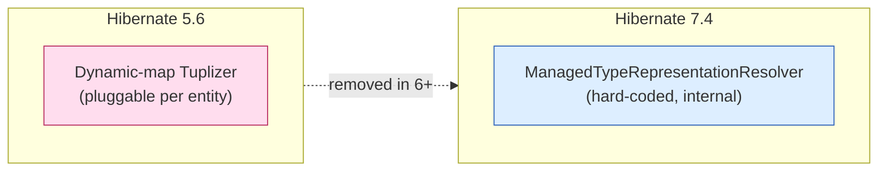
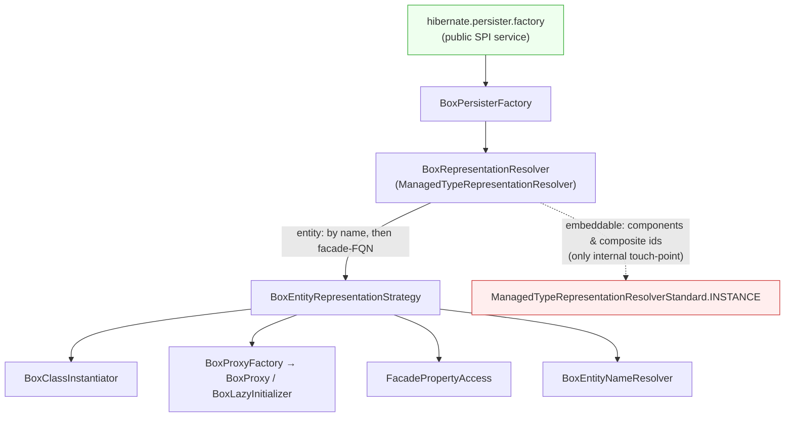
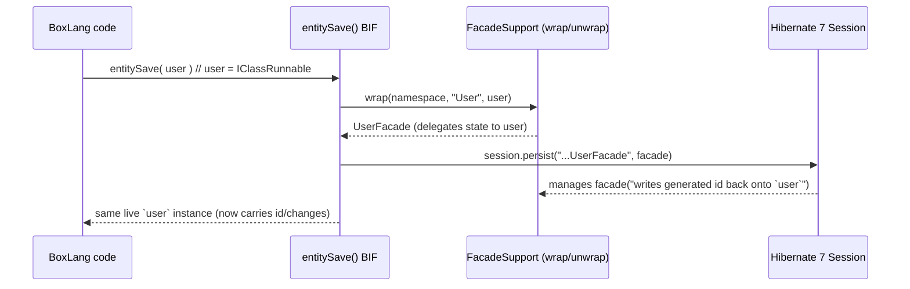
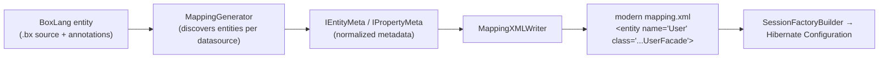
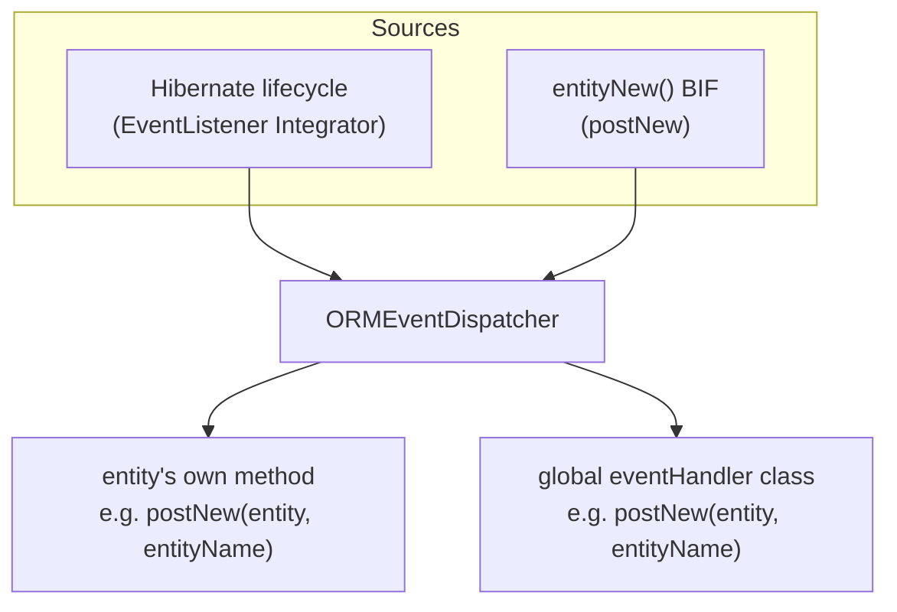
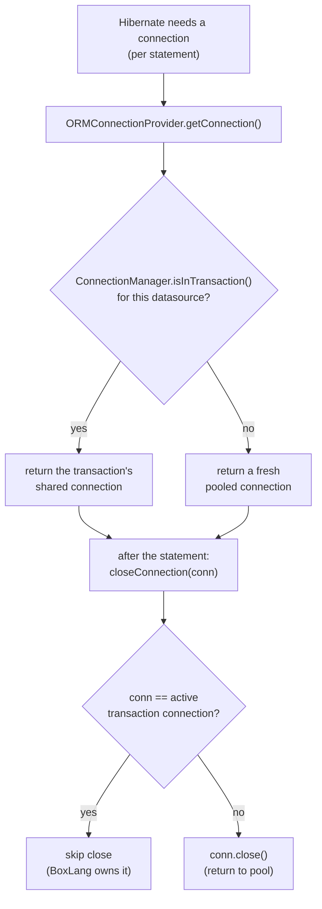
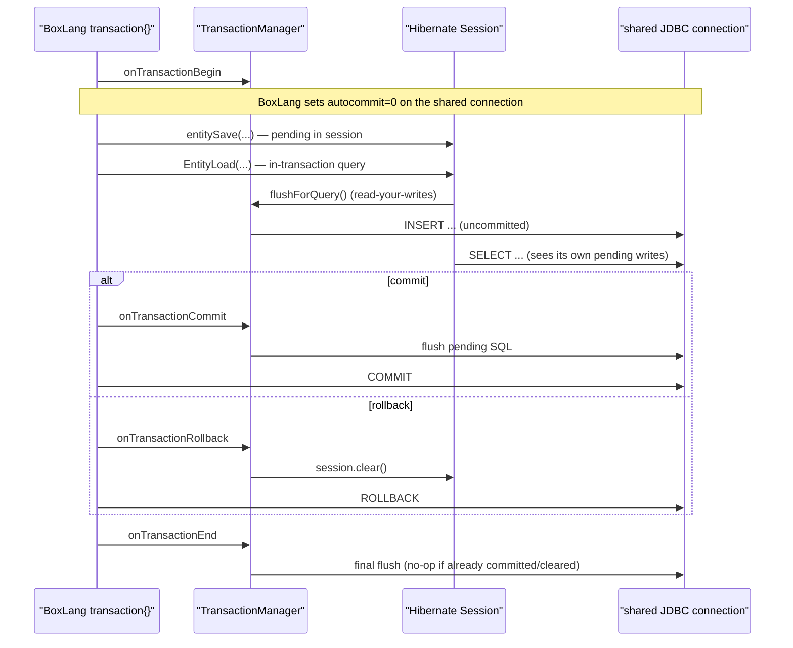

# bx-orm Developer Guide: The Hibernate 5 → 7 Migration

> Audience: contributors and reviewers of `bx-orm`. This document explains **why** the
> module is built the way it is, the design decisions behind the Hibernate 5.6 → 7.4
> migration, and where we intend to take it next. For day-to-day API usage see the end-user
> docs (`ortus-docs/bxorm`); for architecture deep-dives per subsystem see
> `.agents/skills-custom/`.

---

## 1. What bx-orm is

`bx-orm` is the middleware that lets the dynamic **BoxLang** JVM language use **Hibernate ORM**
as its persistence engine. It hides both raw database access and Hibernate's verbose
configuration behind BoxLang-native BIFs (`entityNew`, `entitySave`, `entityLoad`,
`ormExecuteQuery`, …) and `Application.bx` ORM settings.

```
BoxLang app  ──►  bx-orm (this module)  ──►  Hibernate ORM 7.4  ──►  JDBC / RDBMS
   BIFs &          representation bridge,        session factory,
 Application.bx    mapping generation,           dialects, caching
                   events, type conversion
```

The module runs on **Hibernate ORM 7.4.x** (upgraded from 5.6.15). All Hibernate
integration code targets Hibernate 7, not 5.

---

## 2. The core problem the migration had to solve

A BoxLang entity is **not a normal Java class**. It is an `IClassRunnable` — a dynamic object
that implements `java.util.Map`. Hibernate 5 supported non-POJO entities through **Tuplizers**
(`EntityTuplizer` / `Tuplizer`), which let us describe how to instantiate an entity, read a
property, and proxy it, for a "dynamic-map" representation.

**Hibernate 6+ removed Tuplizers.** Instead it resolves how a managed type is represented
through a single internal component, `ManagedTypeRepresentationResolver`, which Hibernate
**hard-codes** to its own standard implementation. There is no drop-in replacement for the old
dynamic-map tuplizer.

So the migration's central question was: *how do we make Hibernate 7 manage a BoxLang
`IClassRunnable` as an entity when Hibernate 7 only wants to manage real Java classes?*



---

## 3. Two representations we evaluated

| Option | What it is | Verdict |
| --- | --- | --- |
| **MAP (class-less)** | Keep entities as dynamic maps; describe them to Hibernate as class-less `<entity metadata-complete="true">` with no backing class. | Worked for basic CRUD, but Hibernate 7's JPA-centric machinery could not express several documented features against a class-less entity: `uuid`/most id generators, composite ids, `byte[]`/binary attributes, and full metamodel access. **Removed.** |
| **POJO facade** ✅ | Generate a **real Java class per entity** (a "facade") whose accessors delegate their state to the backing BoxLang instance. Hibernate manages the facade; developers only ever touch the BoxLang class. | Superset of MAP behavior; unlocks the features above. **This is now the only representation.** |

We shipped both during development behind an `entityFacades` flag, proved parity, then
**removed MAP mode entirely** — the facade is the single representation path. (`entityFacades`
is gone.)

---

## 4. How the facade bridge is wired into Hibernate 7

Because Hibernate 7 hard-codes its representation resolver, we inject ours through the one
**public, pluggable SPI** that lets us reach it: the `hibernate.persister.factory` service.
Everything hangs off that single, supported seam — we do **not** fork or patch Hibernate.



- **`BoxPersisterFactory`** — registered as the `hibernate.persister.factory`. It owns the
  resolver and hands it to Hibernate.
- **`BoxRepresentationResolver`** — our `ManagedTypeRepresentationResolver`. For **entities** it
  returns our strategy; for **embeddables** (components / composite ids) it delegates to
  Hibernate's `internal` `ManagedTypeRepresentationResolverStandard.INSTANCE`.
- **`BoxEntityRepresentationStrategy`** — supplies the BoxLang-aware pieces: the
  `BoxClassInstantiator` (creates a facade + backing instance), `BoxProxyFactory` (lazy
  proxies), `FacadePropertyAccess` (read/write that tolerates a raw `IClassRunnable` owner), and
  `BoxEntityNameResolver`.

### The one internal touch-point (know this before you upgrade Hibernate)

Hibernate exposes **no public factory** for the default *embeddable* representation strategy.
So `BoxRepresentationResolver`'s embeddable branch delegates to the `internal`
`ManagedTypeRepresentationResolverStandard.INSTANCE`. That single, guarded delegation is the
**only** non-public Hibernate touch-point in the module, and it is the first thing to re-check
if a future Hibernate release relocates or renames it.

---

## 5. The facade, concretely

For each mapped entity the module generates a real Java class (e.g. `UserFacade`) whose
getters/setters **delegate to the backing BoxLang `IClassRunnable`** — the two share one state
store. Facade classes are **namespaced per ORM application** (`facadeNamespace`), so two apps in
the same JVM that each map a `User` generate distinct facade classes instead of colliding.



Key rules that fall out of this design:

- **Developers only ever handle BoxLang classes.** Facades are wrapped/unwrapped at the BIF
  boundary and never leak to user code.
- **Hibernate entity-name = the facade class FQN**; the BoxLang name is the JPA/HQL *import*
  alias. By-name Session/metamodel calls are routed through the import name, and
  `BoxEntityNameResolver` reports the facade FQN.
- `ormGetSession()` / `ormGetSessionFactory()` return **facade-aware wrappers**
  (`FacadeAwareHibernate`, a JDK dynamic proxy) so BoxLang entity names/instances work against
  the raw Hibernate API too.
- **One facade classloader per build.** Every ORM build (first boot and each `ormReload()`) gets a
  fresh `FacadeClassLoader`, registered with Hibernate through the bootstrap registry
  (`applyClassLoader`). A classloader can define a class name only once, so this is what lets a
  reload define a changed facade (same FQN, new property) instead of reusing the old class.
- **Self-contained accessors.** Facade getters/setters are static calls
  (`EntityFacadeFactory.Accessors.get/set` with the property name baked in as constants), not
  ByteBuddy `MethodDelegation` to an interceptor instance. The generated bytecode therefore needs
  no class initializer and can be written to `facades.jar` and defined again later as plain bytes.
- **The namespace comes from the booted app.** BIFs resolve it via `ORMContext.getFacadeNamespace()`
  (the `ORMApp`'s config), never the per-request `ORMConfig`, which only ever holds the default.
- **Instances made with `new`** carry no namespace stamp; `FacadeSupport.wrapInstance` falls back to the
  current request's ORM application, so they work even when they only reach Hibernate through a cascade.
- **`entityReload()` on a detached entity.** Hibernate 7 refuses to refresh or `lock()`-reattach a detached
  entity. `EntityReload` loads the row, rebinds that managed facade to the caller's object
  (`FacadeSupport.rebind`, which sets the facade's `boxState`) and refreshes, so the object is managed
  again. If another variable already holds the managed row, it refreshes that one and copies the mapped
  properties onto the caller's object instead.
- **`duplicate()` never shares a facade.** Root facades are `Serializable` with a `writeReplace`
  that yields a marker, so a deep copy of an entity drops the original's memoized facade, and
  `FacadeSupport` ignores any memoized facade that does not wrap the instance it is stored on.

---

## 6. Mapping generation: modern `mapping.xml` (not `hbm.xml`)

Hibernate's legacy `hbm.xml` DTD format is deprecated-for-removal, so we removed our
`HibernateXMLWriter` and now emit only the **modern Hibernate 7 `mapping.xml`** format (root
`<entity-mappings>`, namespace `http://www.hibernate.org/xsd/orm/mapping`, version `7.0`).



The writer emits each entity as `<entity name="User" class="...UserFacade">` and covers ids,
`increment`/`uuid`/`identity` generators, JPA `AttributeConverter`s (`<convert>`), `<version>`,
discriminators, single-table inheritance (incl. a per-subclass `<secondary-table owned="true">`),
joined inheritance, `many-to-one` / `one-to-many` / `many-to-many`, composite ids, formulas,
`<element-collection>` (array→BAG, struct→MAP), and second-level cache.

**Hibernate 5 parity defaults.** JPA's `mapping.xml` defaults differ from classic `hbm.xml`, so the
writer states them explicitly to keep existing apps behaving the same:

- `many-to-one` / `one-to-one` always get an explicit `fetch`: `LAZY` unless `lazy="false"` or
  `fetch="join"` (JPA defaults to-one to `EAGER`).
- The hierarchy root writes its own `discriminator-value` (JPA would default it to the entity name).
- A `one-to-one` without `fkcolumn` and without `mappedBy` shares the primary key
  (`<primary-key-join-column/>`). As in hbm, only a `constrained="true"` side carries the foreign key;
  when the target has a `constrained` one-to-one pointing back, this side is written as its inverse
  (`mapped-by`) so the rows insert in the right order.
- An owning `one-to-many` without `fkcolumn` reuses the target's back-reference `fkcolumn` (the
  target's to-one pointing at this entity) instead of JPA's default join table.
- A collection `where` becomes `<sql-restriction>`; a struct to-many writes `map-key-class` +
  `map-key-column`/`map-key-formula`. Both follow the XSD element order (order-by, map-key,
  batch-size, sql-restriction, join).
- A `fieldtype="timestamp"` version is typed `java.time.Instant`.

---

## 7. Events

BoxLang ORM events reach user code through two channels, unified by a single dispatcher:

- **Hibernate lifecycle events** (`preInsert`, `postLoad`, …) arrive at `EventListener` (a
  Hibernate `Integrator`).
- **`postNew`** has no Hibernate equivalent (Hibernate has no "instantiate" event), so it is
  fired from the `entityNew()` BIF.

Both go through **`ORMEventDispatcher`**, which invokes the entity's own event method and the
configured global `eventHandler` class identically. The global handler is loaded **once per ORM
application** and shared across datasources and the `postNew` path.



---

## 8. Transactions: riding the BoxLang connection

BoxLang owns transactions through the `transaction{}` block. The ORM does **not** run a Hibernate
transaction of its own; it **rides the BoxLang transaction's JDBC connection** so that ORM writes
and native `queryExecute` calls land on the same connection and are governed by one demarcation
unit — committed together, rolled back together. BoxLang performs the real JDBC commit/rollback.

Four pieces cooperate:

- **`ORMConnectionProvider`** — `getConnection()` asks BoxLang's `ConnectionManager` for the
  connection, which is transaction-aware: inside a `transaction{}` bound to this datasource it
  returns the transaction's shared connection, otherwise a fresh pooled one. `closeConnection()`
  **skips** closing a connection that belongs to the active transaction (BoxLang owns its
  lifecycle). `supportsAggressiveRelease()` returns `true`.
- **`SessionFactoryBuilder`** — sets `CONNECTION_HANDLING` to
  `DELAYED_ACQUISITION_AND_RELEASE_AFTER_STATEMENT`, so the session acquires a connection per
  statement and releases it immediately instead of holding one for its lifetime. Each acquisition
  therefore re-reads the *current* transaction connection (or a fresh pooled one outside a
  transaction). This is what makes "ride the transaction connection" work across a request, and it
  avoids a stale reference to a connection BoxLang closed at transaction end.
- **`TransactionManager`** (interceptor) — synchronizes the session with BoxLang's transaction
  events without owning demarcation: **flush** on commit/end (so pending SQL is emitted on the
  shared connection before BoxLang commits it), **clear** on rollback (so the session drops state
  BoxLang rolls back at the JDBC level).
- **`ORMContext.flushForQuery(session)`** — Hibernate suppresses auto-flush-before-query when no
  Hibernate transaction is in progress (and we run none), so the query choke points
  (`ORMApp.loadEntitiesByFilter`, `HQLQuery.execute`) call this to flush first when a transaction
  is active, giving in-transaction ORM queries read-your-writes.

One exception to riding the connection: Hibernate **isolated work** (sequence/table id allocation
via `JdbcIsolationDelegate`) commits or rolls back the connection it is handed. Inside a
transaction `ORMConnectionProvider` detects that caller (a short `StackWalker` check, only when a
transaction is active) and hands it a fresh pooled connection, so id allocation can never commit
the surrounding `transaction{}` mid-flight.

**Connection selection and release, per statement:**



**Transaction lifecycle** (the ORM flushes/clears; BoxLang does the real commit/rollback):



**Nested transactions** are governed entirely by BoxLang. With the default runtime setting
(`enableNestedTransactions=false`, still experimental), BoxLang **flattens** a nested
`transaction{}` into the single outer demarcation unit: a nested `transactionCommit()` performs a
real JDBC commit on the shared connection (it commits the parent too). The `TransactionManager`
does not try to reinterpret this — it treats every event uniformly and lets BoxLang decide what
actually commits. Savepoint-based nesting (where a child commit/rollback is scoped) only exists
when the runtime enables that experimental flag.

---

## 9. Design decisions, at a glance

| Decision | Why |
| --- | --- |
| Inject via `hibernate.persister.factory` SPI | It is the one **public** seam that reaches Hibernate 7's representation resolver; no forking. |
| Generate POJO **facades**, drop class-less MAP | Facades are a superset: they unlock `uuid`/other generators, composite ids, `byte[]`, and full metamodel — none expressible for a class-less entity. |
| Namespace facades per application | Prevent same-named entities in different apps from colliding on one global facade class. |
| Emit **modern `mapping.xml`**, remove `hbm.xml` | `hbm.xml` is deprecated-for-removal; keeps us Hibernate-8 ready. |
| One documented internal touch-point (embeddables) | Hibernate has no public embeddable-strategy factory; isolate and guard the single delegation. |
| Facade-aware Session/SessionFactory wrappers | Preserve the pre-Hibernate-7 behavior consumers such as cborm rely on (by-name calls, `IClassRunnable` args). |
| Single `ORMEventDispatcher` for all events | One resolution/invocation path for Hibernate events and the bx-orm-native `postNew`. |
| ORM rides the BoxLang transaction connection (no own Hibernate tx) | One demarcation unit for ORM + native queries; BoxLang owns commit/rollback, so its transaction model governs ORM writes. |
| Per-statement connection release (`RELEASE_AFTER_STATEMENT` + aggressive release) | Lets each statement re-read the current transaction connection and avoids a stale reference after BoxLang closes it at transaction end. |

---

## 10. Migration notes (5.6 → 7.4)

- **Tuplizer → representation strategy** injected via `hibernate.persister.factory` (see §4).
- **`saveOrUpdate()` removed** — `entitySave()` now uses `persist()` for new entities and
  `merge()` for detached ones, then copies managed state back so the caller's instance stays
  live and carries generated ids/event changes.
- **`hbm.xml` writer removed** — modern `mapping.xml` only.
- **Dialects** — legacy version-specific aliases (`MySQL57`, `Oracle10g`, `DerbyTenSeven`, …)
  are mapped to the current version-detecting dialect with a one-time deprecation warning;
  databases that moved to `hibernate-community-dialects` (SQLite, Derby, Firebird, …) resolve to
  that artifact automatically.
- **Removed the `entityFacades` and `ormXmlMapping` settings** — the facade + modern-mapping
  paths are now the only paths.

---

## 11. The ORM manifest boot cache (`.bxorm/`)

Boot has three costs: entity **discovery** (walking the tree), **metadata parsing** (per entity,
scales linearly with entity count), **mapping generation**, and Hibernate's own `SessionFactory`
build (a fixed floor we cannot avoid). Profiling a cold boot showed metadata parsing + mapping
generation dominate for large-entity apps, while Hibernate's build is a fixed ~2s floor. The
manifest cache targets the part we *can* remove.

**The `ormManifest` setting** (default `off`):

| Mode | Behavior |
| --- | --- |
| `off` | Discover, parse and generate every boot (unchanged legacy behavior). |
| `auto` | Discover normally, then write the resolved boot model to `.bxorm/manifest.json` so it stays current. Dev mode. |
| `trust` | Boot **straight from** `.bxorm/manifest.json` — no discovery, parsing or mapping generation. Integrity-checked and **fail-closed** (a missing/corrupt manifest is a hard error, never a silent fallback). Production mode. |

**Location.** By default the `.bxorm/` folder lives at the application root. Set `ormManifestLocation`
in `Application.bx` (`this.ormSettings`) to put it elsewhere: a relative path resolves against the
app root, an absolute path is used as-is, and the folder name is always `.bxorm` (only its parent
moves). The `bxorm` CLI mirrors this with `--dir=<path>`. `ManifestService.resolveFolder(context,
location)` is the single resolver all boot reads/writes go through.

**Performance (estimated).** These are extrapolations from cold-boot profiling, not a fresh
benchmark run — replace them with formal `./gradlew jmhCompare` numbers when available. A cold boot
pays four costs: entity **discovery**, **metadata parsing** (scales with entity count),
**mapping generation**, and **facade codegen** — plus Hibernate's own `SessionFactory` build, a
fixed **~2s floor** we cannot remove. Profiling showed the first four dominate for large-entity
apps. `trust` mode removes all four: it reads a single `manifest.json` and injects the pre-built
`facades.jar`, so boot collapses toward the ~2s Hibernate floor.

| App size | `off` cold boot (discover + parse + map + codegen + ~2s build) | `trust` cold boot (manifest read + ~2s build) | Estimated cold-start speedup |
| --- | --- | --- | --- |
| Small (a handful of entities) | Floor-dominated | ≈ floor | Modest — the fixed ~2s build dominates either way |
| Large (dozens of entities) | Parse/map/codegen is the **majority** of above-floor time | ≈ floor + one file read | **Considerable** — an estimated ~2–4× faster cold start |

The boost grows with entity count: the removed work scales with the number of entities, while
`trust` mode's cost (one manifest read + facade injection) is effectively flat. Zero entity-file
I/O and no ByteBuddy codegen at boot are the two levers.

**What the manifest stores** (`OrmManifest`, serialized as JSON via BoxLang's own `JSONUtil` so it
round-trips through BoxLang types): a format version, an ORM version stamp, a config fingerprint,
and per entity its name, class FQN, datasource, a source-file fingerprint (`path`/`hash`/`mtime`/
`size`), the **normalized metadata struct** (exactly what `AbstractEntityMeta.autoDiscoverMetaType`
consumes), and its generated `<entity>` mapping XML. Rehydration rebuilds each `IEntityMeta` from
the stored metadata and produces a **byte-identical** mapping — this invariant is the core test.

**Zero-I/O boot.** The combined Hibernate `mapping.xml` is now handed to Hibernate **in memory**
via `Configuration.addInputStream()` (previously a temp file was written and re-read). `EntityRecord`
carries its mapping XML in memory; a `trust`-mode boot reads the manifest (plus `facades.jar`) and
feeds Hibernate from memory. The only entity-file I/O is the staleness check below: one `stat` per
entity, and a re-hash only when size or mtime changed.

**Staleness guard.** Before a `trust` boot, `ManifestService.verify(manifest, config, version)`
compares the running app against the manifest and fails closed, naming every change:

- the ORM settings fingerprint (dialect, datasource, naming strategy, facade namespace i.e.
  application name, `dbcreate`, `quoteIdentifiers`, `entityPaths`);
- the bx-orm module version (skipped when either side is a `dev`/unreplaced build);
- each entity source file still at its recorded path (same size and mtime are trusted, otherwise it
  is re-hashed).

A source that is not at its recorded path (manifest generated on a build machine with a different
checkout) cannot be checked and is skipped, and newly added entity files are not detected (trust mode
does no discovery). Regenerate the manifest with an `auto` boot after changing entities.

**Integrity guard (v1).** `write()` is atomic (temp + move) and emits a `manifest.sha256` sidecar;
`read()` recomputes and compares it, failing closed on mismatch (detects corruption / naive edits).
Stronger tamper-resistance (an HMAC/signature keyed by a deploy secret) is a documented v2 option.

**`facades.jar` bytecode cache.** In `auto`, the ByteBuddy-generated facade bytecode is captured into
`.bxorm/facades.jar` after the session factories build (only facades with no live class initializer
are captured, see "Self-contained accessors" in §5); in `trust`, the jar's bytes are handed to that
build's `FacadeClassLoader`, which defines them instead of re-running codegen, with a transparent
ByteBuddy fallback if a class cannot be defined. ByteBuddy stays a dependency (it is only skipped at
runtime, not removed).

### The `bxorm` CLI

`box.json` declares the `bxorm` executable and `ModuleConfig.main()` dispatches to the Java
`ManifestCli`. Every verb inspects the on-disk `.bxorm/` boot cache **without booting Hibernate**.
The folder is resolved against the working directory, overridable with `--dir=<path>`.

```text
boxlang module:orm <verb> [args]      # or, via the declared executable:  bxorm <verb> [args]
```

| Verb | What it does |
| --- | --- |
| `info` (default) | Manifest header (versions, config fingerprint) + entity count |
| `validate` | Integrity- and format-check the manifest; non-zero exit on failure |
| `entities` | List the entities recorded in the manifest |
| `entity <name>` | Show one entity's class, datasource, source and mapping XML (case-insensitive) |
| `mappings` | Print the combined Hibernate `mapping.xml` |
| `clear` | Delete the `.bxorm/` boot cache |
| `version` | Module + manifest format versions |
| `help` | Show usage (aliases: `-h`, `--help`; `version` also as `-v`/`--version`) |

Generation is intentionally **not** a verb: `auto` mode writes the manifest on every boot, which is
the supported generation path.

#### Example output

Captured from real `ManifestCli` runs against a two-entity manifest (`Person`, `Passport`, no
`facades.jar`). Paths are shown as `/app/.bxorm` for readability.

```text
$ boxlang module:orm info
📦 ORM manifest [/app/.bxorm]
  format version   : 1
  built by ORM     : 2.0.0
  config fingerprint: 20ccab44a96d
  entities         : 2
  integrity        : ✅ checksummed
  facades.jar      : ➖ absent
```

```text
$ boxlang module:orm validate
✅ ORM manifest at [/app/.bxorm] is valid (2 entities, format 1).
```

A tampered `manifest.json` fails validation with exit code `1`:

```text
$ boxlang module:orm validate
❌ ORM manifest is INVALID: ORM manifest integrity check failed at [/app/.bxorm/manifest.json]: checksum mismatch. The manifest is corrupt or was modified; regenerate it.
```

```text
$ boxlang module:orm entities
📦 Entities in the ORM manifest (2):
  • Person  [models.Person]  datasource=appDB
  • Passport  [models.Passport]  datasource=appDB
```

The mapping XML below is truncated (`…`):

```text
$ boxlang module:orm entity person
🔎 Entity [Person]
  class     : models.Person
  datasource: appDB
  source    : {
  mtime : 1790166074296,
  path : "/app/models/Person.bx",
  size : 464,
  hash : "5fe43e29806515a3f0ea6fca47191cfba3a6f0a422b3654c0c1b5bda9089fdf8"
}
  mapping XML:
<?xml version="1.0" encoding="UTF-8" standalone="no"?>
<!--
~ Generated by the Ortus BoxLang ORM module for use in BoxLang web applications.
~
~ https://github.com/ortus-boxlang/bx-orm
~ https://boxlang.io
~ https://docs.jboss.org/hibernate/orm/current/userguide/html_single/Hibernate_User_Guide.html
--><entity-mappings version="7.0" xmlns="http://www.hibernate.org/xsd/orm/mapping">
    <entity class="ortus.boxlang.modules.orm.hibernate.facade.generated.default.PersonFacade" name="Person">
        <table name="feat_person"/>
…
```

`mappings` prints each entity's mapping document in turn (truncated here after the first ~15 lines):

```text
$ boxlang module:orm mappings
<?xml version="1.0" encoding="UTF-8" standalone="no"?>
<!--
~ Generated by the Ortus BoxLang ORM module for use in BoxLang web applications.
~
~ https://github.com/ortus-boxlang/bx-orm
~ https://boxlang.io
~ https://docs.jboss.org/hibernate/orm/current/userguide/html_single/Hibernate_User_Guide.html
--><entity-mappings version="7.0" xmlns="http://www.hibernate.org/xsd/orm/mapping">
    <entity class="ortus.boxlang.modules.orm.hibernate.facade.generated.default.PersonFacade" name="Person">
        <table name="feat_person"/>
        <batch-size>25</batch-size>
        <attributes>
            <id name="id">
                <column name="id"/>
                <generated-value generator="Person_id_generator"/>
…
```

```text
$ boxlang module:orm version
🏷️  bx-orm module : 2.0.0
manifest format expected : 1
manifest format on disk  : 1
manifest built by ORM    : 2.0.0
```

```text
$ boxlang module:orm help
📦 bxorm - ORM manifest boot-cache tool

Usage: boxlang module:orm <verb> [args]

Verbs:
  info                 Show the manifest header and entity count (default).
  validate             Integrity- and format-check the manifest; non-zero exit on failure.
  entities             List the entities recorded in the manifest.
  entity <name>        Show one entity's class, datasource, source and mapping XML.
  mappings             Print the combined Hibernate mapping XML.
  clear                Delete the .bxorm/ boot cache.
  version              Show module and manifest format versions.
  help                 Show this help.

The manifest is generated by booting your app once with ormManifest="auto";
in production, ormManifest="trust" loads it with no discovery or parsing.
```

An unknown verb exits with code `1` and prints the error followed by the same usage text:

```text
$ boxlang module:orm frobnicate
❌ Unknown verb [frobnicate].

📦 bxorm - ORM manifest boot-cache tool
…
```

```text
$ boxlang module:orm clear
🧹 Cleared the ORM boot cache at [/app/.bxorm].
```

After `clear`, `info` reports the absence (exit `0`), while `validate` fails closed (exit `1`):

```text
$ boxlang module:orm info
ℹ️  No ORM manifest found at [/app/.bxorm]. Boot the app once with ormManifest="auto" to generate it.
```

```text
$ boxlang module:orm validate
❌ ORM manifest is INVALID: ORM manifest mode is [trust] but no manifest was found at [/app/.bxorm/manifest.json]. Generate it first (bxorm manifest generate) or switch ormManifest to [auto].
```

**Auto-mode self-watcher.** In `auto` mode, `ORMApp.startup` calls `ORMService.ensureEntityWatcher`,
which starts one `ORMEntityWatcher` per application (idempotent) over the entity paths (recursive,
500ms debounce), built on BoxLang's `WatcherService`. A file-change event fires on a background
thread that has neither a request/JDBC context nor the `loadApplicationDescriptor`/`onRequestStart`
initialization a reload needs, so the watcher does not reload directly — attempting a reload there
fails to open a datasource connection. Instead its listener flags the app for reload
(`ORMService.dirtyApps`). `ORMService.getORMAppByContext` — which runs on a real request thread with
a fully-initialized, thread-valid context — sees the flag, clears it (`Set.remove`, so a single
request reloads while concurrent ones do not), and calls `reloadApp`. This is also the correct
semantics: a reload is only observable through a request (edit a file, hit the app, see the change).
The watcher is owned by the `ORMService`, not the `ORMApp`, so a reload (which swaps the `ORMApp` but
not the entity paths) leaves it running and it keeps detecting changes across reloads; it is stopped
only on a real `shutdownApp`. Generated `*.orm.xml` and any `/.bxorm/` path are ignored by the
listener so a reload's own writes never retrigger it. Startup is wrapped so a runtime without a
watcher service just logs a warning and disables live reload. Class: `ORMEntityWatcher`; wired via
`ORMService.ensureEntityWatcher`/`stopEntityWatcher` and the reload check in `getORMAppByContext`.

Code: `ortus.boxlang.modules.orm.mapping.manifest` (`OrmManifest`, `ManifestService`, `ManifestCli`)
and `ortus.boxlang.modules.orm.config.ORMEntityWatcher`; wired in `ORMApp.startup` →
`resolveEntityMap`, `EntityFacadeFactory` (facade jar load/write), `ModuleConfig.main`,
`ORMService.ensureEntityWatcher`, and the auto-reload check in `ORMService.getORMAppByContext`.

## 12. Where we go next

- **cborm-compatible path** — produce a facade/representation that cborm can adopt; cborm keeps
  working as-is until a new path is proven.

---

## 13. Where the code lives

| Area | Package / path |
| --- | --- |
| BIFs | `ortus.boxlang.modules.orm.bifs` |
| Config, events, dialects, naming | `ortus.boxlang.modules.orm.config` |
| Facade bridge (representation, proxies, wrap/unwrap) | `ortus.boxlang.modules.orm.hibernate` and `…/hibernate/facade` |
| Mapping generation & the modern writer | `ortus.boxlang.modules.orm.mapping` |
| ORM manifest boot cache (`.bxorm/`) | `ortus.boxlang.modules.orm.mapping.manifest` |
| Session lifecycle | `ORMService` → `ORMApp` → `ORMContext`, `SessionFactoryBuilder` |
| Subsystem deep-dives | `.agents/skills-custom/` |

> **Before committing:** run `gradle spotlessApply` (Java formatting) and
> `npx markdownlint-cli2 "**/*.md"` (Markdown), and add a `changelog.md` entry under
> `## [Unreleased]`.
